# DevHire Cloud - Production Microservices Recruitment Platform

[](https://github.com/JasonTM17/DevHire_Cloud_Spring_Microservices/actions/workflows/ci.yml)
[](https://github.com/JasonTM17/DevHire_Cloud_Spring_Microservices/actions/workflows/docker.yml)
[](https://github.com/JasonTM17/DevHire_Cloud_Spring_Microservices/actions/workflows/security.yml)
[](https://github.com/JasonTM17/DevHire_Cloud_Spring_Microservices/actions/workflows/docs.yml)
[](https://github.com/JasonTM17/DevHire_Cloud_Spring_Microservices/actions/workflows/terraform.yml)

DevHire Cloud là một dự án portfolio backend/DevOps/Solution Architecture được xây dựng như một nền tảng tuyển dụng mini ITviec/LinkedIn Jobs. Mục tiêu của dự án không phải là demo CRUD đơn giản, mà là chứng minh năng lực thiết kế, triển khai, kiểm thử và vận hành một hệ thống microservices Java Spring Boot production-style.

Repository hiện có Java 21, Spring Boot 3.5.13, Spring Cloud 2025.0.2, API Gateway, JWT security, Kafka/outbox, OpenSearch, PostgreSQL service-owned databases, Claude Haiku AI assistant, Docker Compose full stack, observability, CI/CD, Kubernetes/Helm/GitOps, AWS Terraform blueprint, Next.js frontend và bộ kiểm thử tự động.

## 30-Second Review

DevHire Cloud is a production engineering portfolio, not a single-service CRUD demo. It shows how a recruitment platform can be decomposed into service-owned databases, secured through a gateway, coordinated with Kafka/outbox events, searched through OpenSearch, operated with SLO dashboards, released through CI/CD, and explained through a Claude Haiku assistant.

Best reviewer path:

1. Scan the screenshots and release evidence below.
2. Open [Professional review map](docs/professional-review-map.md) for the 5/15/30-minute review route.
3. Run `.\scripts\verify.ps1 -Docs -Docker` for a fast local gate.
4. Run Docker and smoke tests when you want runtime proof.
5. Check [v0.2.0 release evidence](docs/release-evidence/v0.2.0.md) and [v0.3.0 roadmap evidence](docs/release-notes/v0.3.0.md).

## Production Proof

| Signal | Evidence |
|---|---|
| Microservice boundaries | Dedicated modules, service-owned PostgreSQL databases, Flyway migrations, no shared JPA entities |
| Security | JWT/refresh rotation, gateway validation, role checks, Gitleaks, Trivy, dependency review, secret policy |
| Event reliability | Kafka events, transactional outbox, retry/dead-letter states, idempotent consumers |
| Operations | Prometheus, Grafana SLO dashboard, Loki, Tempo, OpenTelemetry, Mailpit, chaos smoke, DR scripts |
| Delivery | GitHub Actions, Docker matrix builds, GHCR release images, release notes, release evidence |
| Cloud readiness | Kubernetes, Helm, Argo CD, AWS Terraform blueprint, External Secrets wiring |
| AI portfolio layer | Claude Haiku assistant, RAG-style citations, fallback mode, tool traces, AI evaluation script |

## Portfolio Screenshots

Ảnh được tạo từ frontend thật qua Playwright và Docker runtime, không phải mockup tĩnh.

| Jobs | Job Detail |
|---|---|
| 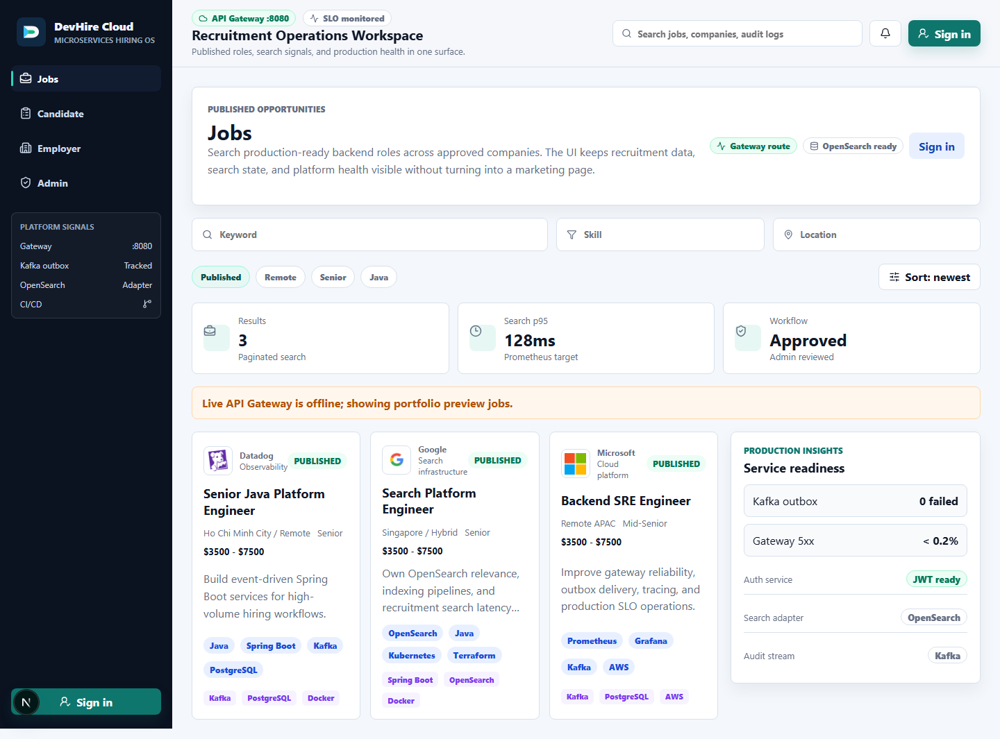 | 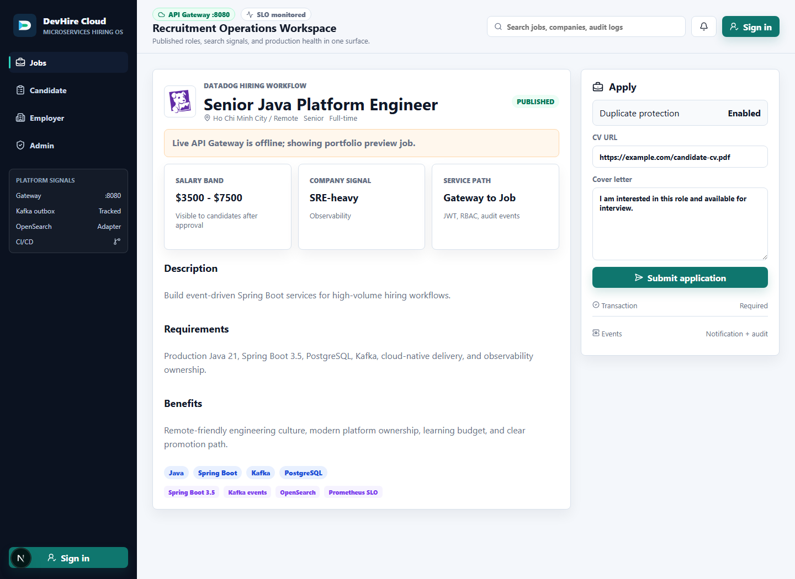 |

Docker runtime qua API Gateway thật:

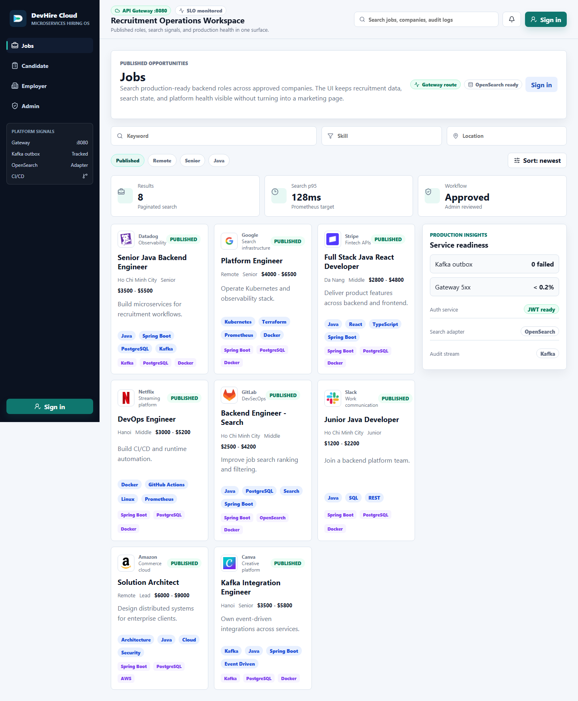

| Candidate | Employer | Admin |
|---|---|---|
| 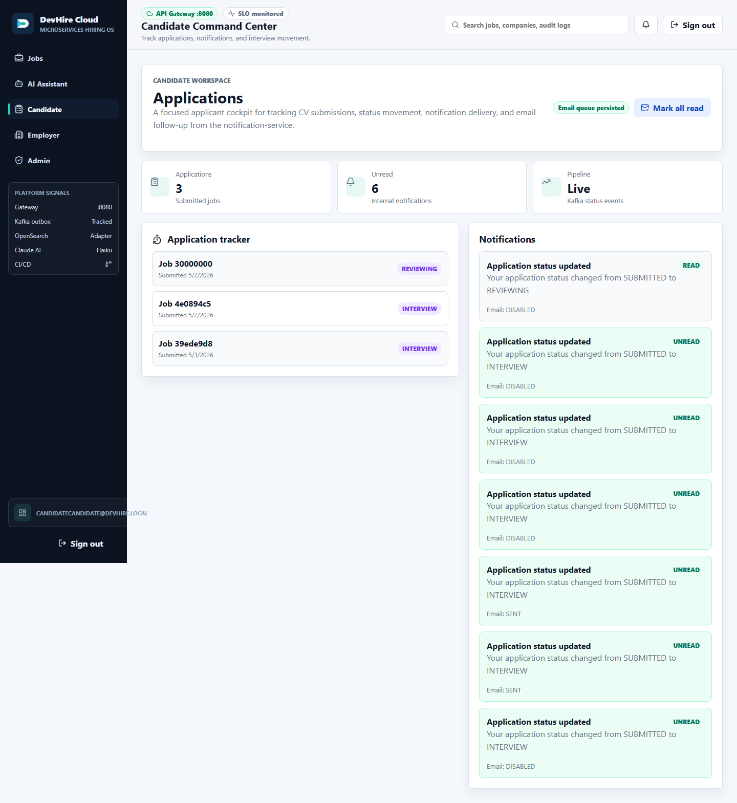 | 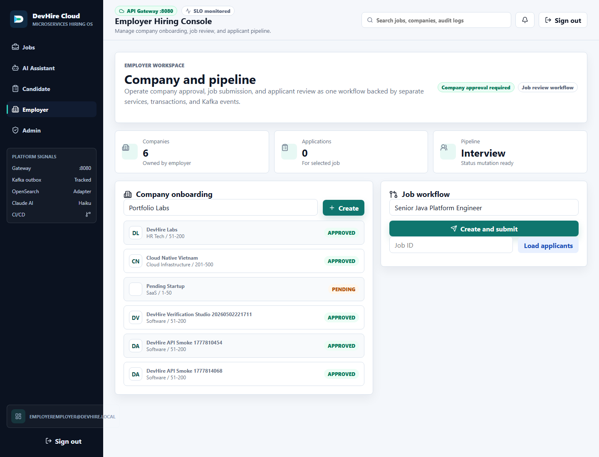 | 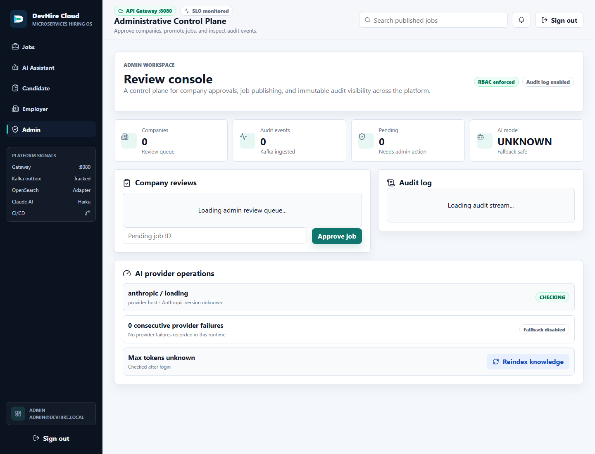 |

Claude AI assistant:

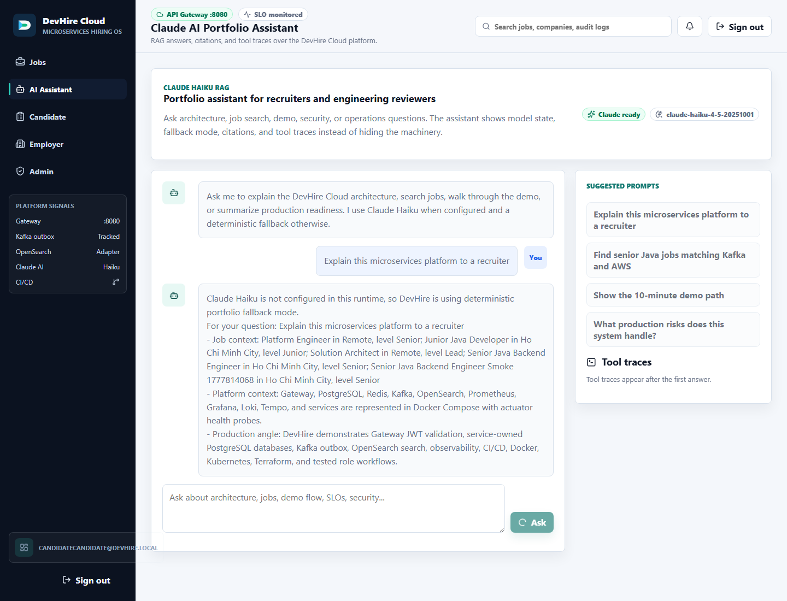

Operations evidence từ stack local:

| AI Provider Ops | Mailpit SMTP Sandbox |
|---|---|
| 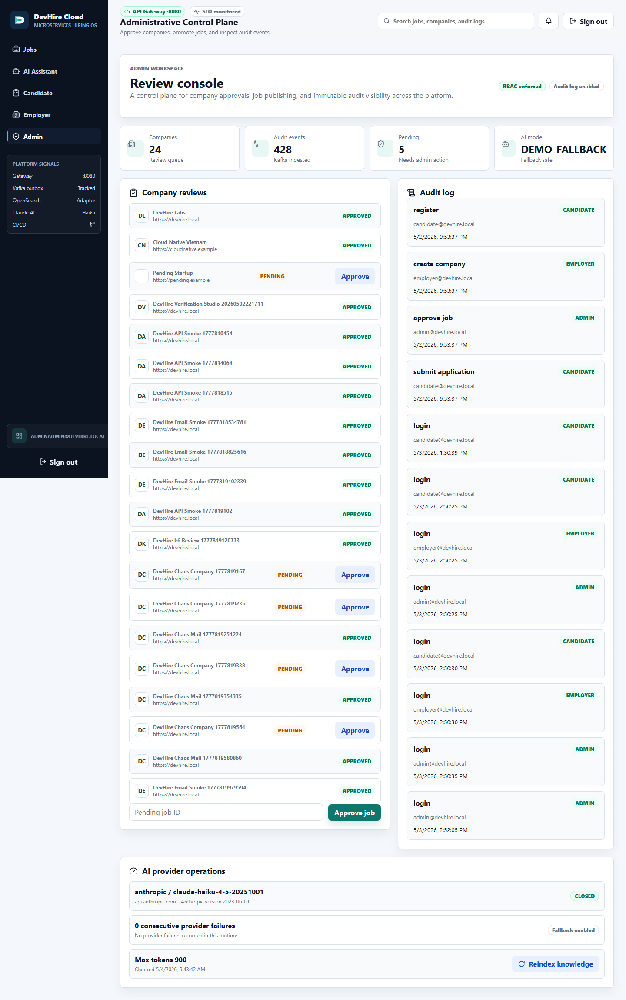 | 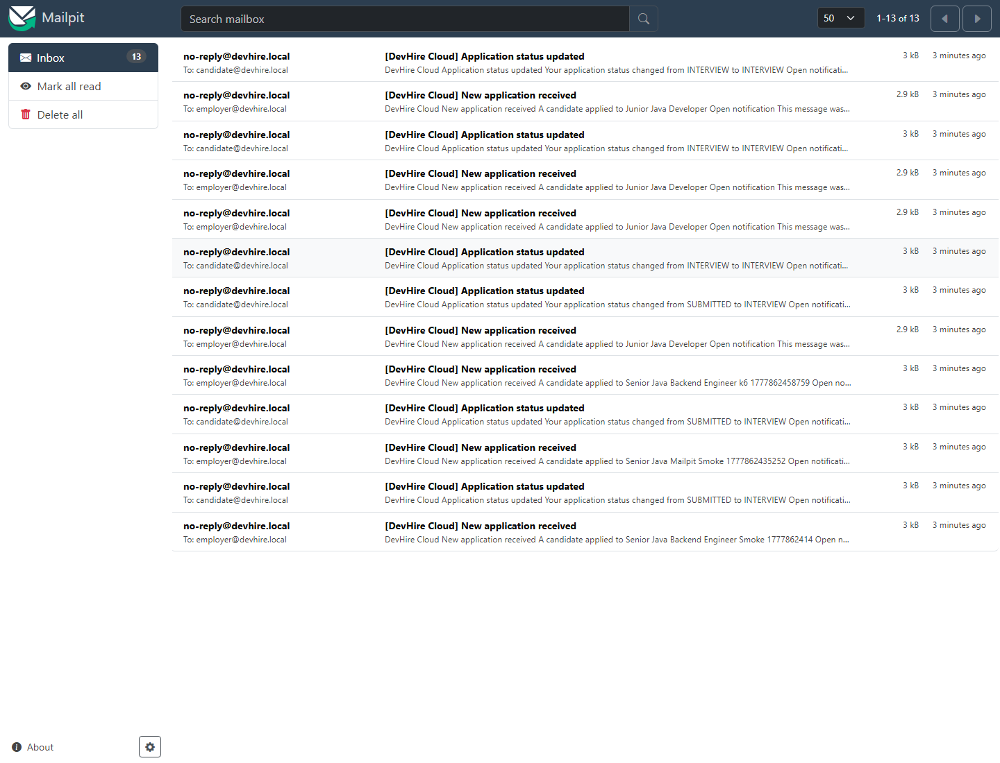 |

| OpenAPI Job Service | Prometheus Rules | Grafana SLO |
|---|---|---|
| 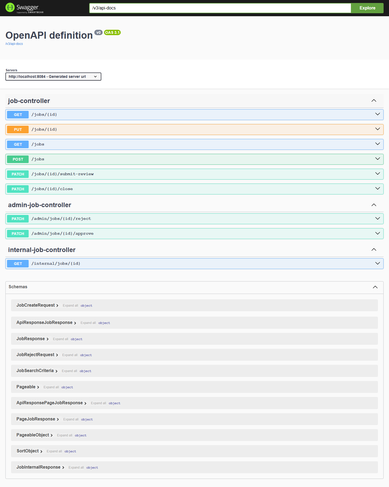 | 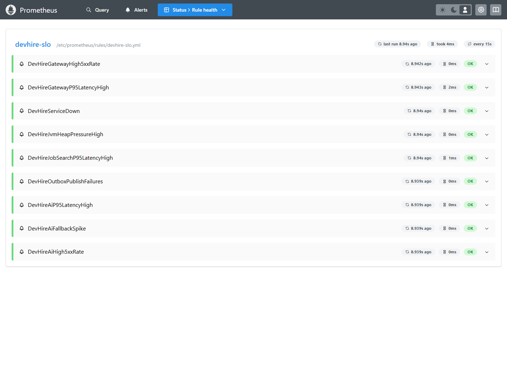 | 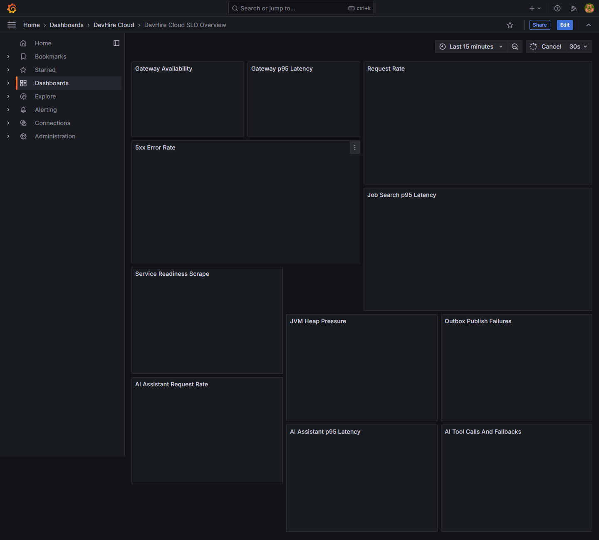 |

## Vì Sao Dự Án Này Đáng Xem

- Thiết kế microservices có ranh giới rõ: mỗi service có database riêng, migration riêng, API riêng, không share entity JPA.
- Luồng tuyển dụng có đủ vai trò Candidate, Employer và Admin.
- Gateway xử lý JWT validation, CORS, rate limit và routing.
- Event-driven communication dùng Kafka, transactional outbox và idempotent consumers.
- Job search dùng OpenSearch, có PostgreSQL fallback adapter.
- Observability gồm Actuator, Prometheus, Grafana, OpenTelemetry, Tempo và Loki.
- CI/CD có Maven verify, frontend build, Docker image build, security scan, SBOM, Terraform validate, API smoke, AI eval, k6 smoke và Playwright E2E.
- Infrastructure có Docker Compose, Kubernetes manifests, Helm chart, Argo CD sample và AWS Terraform blueprint.

## Kiến Trúc

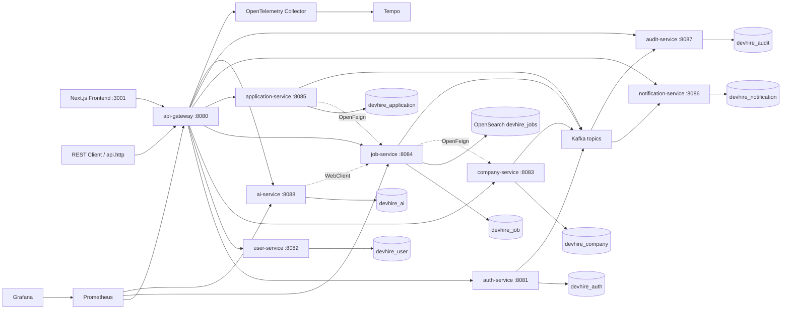

## Tech Stack

- Java 21, Maven multi-module.
- Spring Boot 3.5.13, Spring Cloud 2025.0.2, Spring Cloud Gateway.
- Spring Security, JWT, BCrypt, role-based authorization.
- PostgreSQL 17, Flyway, JPA/Hibernate.
- Redis cho rate limit và token blacklist.
- Kafka, transactional outbox, idempotent consumers.
- OpenSearch job search, PostgreSQL fallback.
- Anthropic Claude Haiku assistant, RAG-style retrieval, citations, streaming UI.
- OpenFeign cho service-to-service reads.
- Springdoc OpenAPI, Actuator, Micrometer, OpenTelemetry.
- Prometheus, Grafana, Loki, Tempo.
- JUnit 5, Mockito, MockMvc, Testcontainers, JaCoCo.
- Docker Compose, GitHub Actions, Trivy, Gitleaks, SBOM.
- Kubernetes, Helm, Argo CD, AWS Terraform blueprint.
- Next.js 16, React 19, TypeScript.

## Services

| Service | Port | Trách nhiệm |
|---|---:|---|
| api-gateway | 8080 | Public ingress, JWT validation, CORS, Redis rate limit, routing |
| auth-service | 8081 | Register, login, refresh token rotation, logout, `/auth/me` |
| user-service | 8082 | Candidate/employer profile |
| company-service | 8083 | Company onboarding, admin approval/rejection |
| job-service | 8084 | Job workflow, OpenSearch search/filter/page/sort |
| application-service | 8085 | Candidate apply, employer status tracking, status history |
| notification-service | 8086 | Internal notification, SMTP email queue/retry |
| audit-service | 8087 | Audit log ingestion và admin query |
| ai-service | 8088 | Claude Haiku assistant, RAG, citations, metrics, audit events |
| common-lib | - | Error model, headers, event DTOs, outbox support |
| frontend | 3001 | Next.js UI cho jobs, candidate, employer, admin |

## Luồng Demo Chính

1. Employer đăng nhập.
2. Employer tạo company.
3. Admin approve company.
4. Employer tạo job và submit review.
5. Admin approve job.
6. Candidate search job đã publish.
7. Candidate apply bằng CV URL.
8. Employer chuyển application sang `INTERVIEW`.
9. Candidate nhận notification.
10. Candidate hỏi AI assistant về demo path hoặc kiến trúc.
11. Admin xem audit log.

## Chạy Bằng Docker

```powershell
docker compose up --build
```

URL chính:

- Frontend: `http://localhost:3001`
- API Gateway: `http://localhost:8080`
- Grafana: `http://localhost:3000` với `admin/admin`
- Prometheus: `http://localhost:9090`
- OpenSearch: `http://localhost:9200`
- OpenSearch Dashboards: `http://localhost:5601`
- Mailpit email sandbox: `http://localhost:8025`
- Tempo: `http://localhost:3200`
- Loki: `http://localhost:3100`
- AI Assistant: `http://localhost:3001/assistant`

Nếu port local bị trùng, chỉnh các biến `*_HOST_PORT` trong `.env`.

## Build Và Test

Backend:

```powershell
mvn -T1 clean verify
```

Frontend:

```powershell
cd frontend
npm ci
npm run typecheck
npm run build
```

API smoke qua Gateway:

```powershell
.\scripts\api-smoke.ps1 -GatewayUrl http://localhost:8080
```

AI assistant evaluation:

```powershell
.\scripts\ai-eval.ps1 -GatewayUrl http://localhost:8080
```

Performance smoke:

```powershell
.\scripts\perf-suite.ps1 -GatewayUrl http://localhost:8080 -Scenario all -Vus 5 -Duration 30s -UseDocker
```

Operations smoke:

```powershell
.\scripts\email-smoke.ps1 -GatewayUrl http://localhost:8080 -MailpitUrl http://localhost:8025
.\scripts\openapi-verify.ps1 -GatewayUrl http://localhost:8080
.\scripts\chaos-smoke.ps1 -GatewayUrl http://localhost:8080 -Scenario all -Recover
.\scripts\dr-verify.ps1 -GatewayUrl http://localhost:8080
```

## Demo Accounts

| Role | Email | Password |
|---|---|---|
| ADMIN | `admin@devhire.local` | `Admin@123456` |
| EMPLOYER | `employer@devhire.local` | `Employer@123456` |
| CANDIDATE | `candidate@devhire.local` | `Candidate@123456` |

## API Chính Qua Gateway

- `POST /api/auth/register`
- `POST /api/auth/login`
- `POST /api/auth/refresh`
- `POST /api/auth/logout`
- `GET /api/auth/me`
- `GET /api/users/me`
- `PUT /api/users/me`
- `POST /api/companies`
- `PATCH /api/admin/companies/{id}/approve`
- `POST /api/jobs`
- `GET /api/jobs`
- `PATCH /api/admin/jobs/{id}/approve`
- `POST /api/jobs/{jobId}/applications`
- `PATCH /api/applications/{id}/status`
- `GET /api/notifications`
- `GET /api/admin/audit-logs`
- `POST /api/ai/chat`
- `POST /api/ai/chat/stream`
- `POST /api/admin/ai/knowledge/reindex`
- `GET /api/admin/ai/provider/status`

Xem flow chạy được tại [docs/api.http](docs/api.http).

## Production-Ready Highlights

- Service-owned databases và Flyway migrations.
- Constraints/index thật, optimistic locking ở các aggregate quan trọng.
- JWT access token ngắn hạn, refresh token rotation, Redis blacklist.
- Gateway-side JWT validation, CORS, rate limit.
- Transactional outbox, Kafka events, idempotent consumers.
- OpenSearch adapter với fallback PostgreSQL.
- Claude Haiku AI assistant có fallback demo mode, citations, tool traces, metrics và audit events.
- Admin dashboard hiển thị AI provider diagnostics, circuit breaker state và knowledge reindex.
- Persisted notification delivery status, SMTP retry/backoff và Gmail runbook.
- Mailpit local email sandbox cho SMTP capture thật trong Docker.
- OpenAPI conformance, role-based k6 suite, chaos smoke và DR verification scripts.
- Standard error response có `traceId`.
- Prometheus alerts, Grafana SLO dashboard, trace/log stack.
- Docker multi-stage images chạy non-root.
- Kubernetes raw manifests, Helm chart, Argo CD sample.
- AWS Terraform blueprint có cost guardrails.
- GitHub Actions CI/CD, Trivy, Gitleaks, SBOM, Dependabot, AI eval gate.
- Unit, controller, contract, integration, E2E và performance smoke tests.

## Tài Liệu Quan Trọng

- [Architecture](docs/architecture.md)
- [Portfolio case study](docs/portfolio-case-study.md)
- [Production readiness](docs/production-readiness.md)
- [Security and supply chain](docs/security.md)
- [Security evidence](docs/security-evidence.md)
- [SLO operations](docs/slo.md)
- [Deployment runbook](docs/deployment.md)
- [Email sandbox](docs/email-sandbox.md)
- [Gmail SMTP runbook](docs/gmail-smtp.md)
- [Backup and restore runbook](docs/runbooks/backup-restore.md)
- [External Secrets and GitOps](docs/external-secrets.md)
- [Claude AI assistant](docs/ai-assistant.md)
- [Claude Haiku provider](docs/claude-haiku.md)
- [AI evaluation gate](docs/ai-evaluation.md)
- [AWS Terraform blueprint](docs/aws-terraform.md)
- [Cloud readiness review](docs/cloud-readiness-review.md)
- [Unified verification runner](docs/verification.md)
- [Versioning and release hygiene](docs/versioning.md)
- [Dependency maintenance policy](docs/dependency-maintenance.md)
- [API compatibility policy](docs/api-compatibility.md)
- [Release evidence v0.2.0](docs/release-evidence/v0.2.0.md)
- [Recruiter review guide](docs/recruiter-review-guide.md)
- [Release notes v0.2.0](docs/release-notes/v0.2.0.md)
- [10-minute demo script](docs/demo-script.md)
- [GitHub profile checklist](docs/github-profile.md)
- [Architecture Decision Records](docs/ADR/0001-microservices-and-service-databases.md)

## Roadmap Sau v0.2.0

- Deploy AWS Terraform blueprint vào staging account thật.
- Thêm soak test dài hơn và automated error-budget burn simulation.
- Tích hợp email provider sandbox production-grade.
- Bắt buộc signed container provenance trước release.
