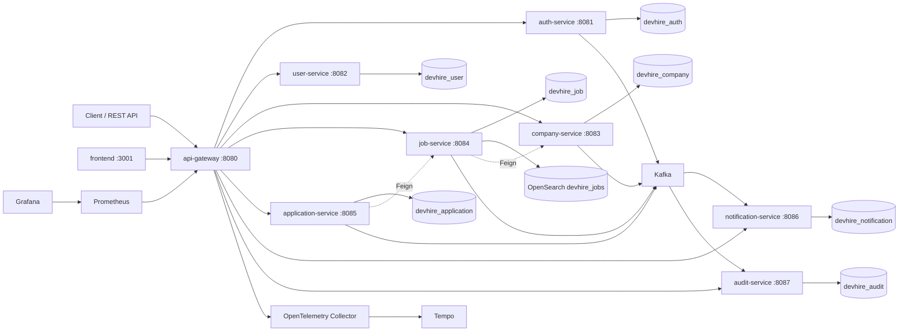

# DevHire Cloud - Microservices Recruitment Platform

DevHire Cloud là nền tảng tuyển dụng dạng mini ITviec/LinkedIn Jobs, được xây dựng như một dự án portfolio backend production-ready bằng Java 21, Spring Boot 3.5.13 và Spring Cloud 2025.0.2.

Dự án tập trung vào kiến trúc microservices, bảo mật JWT, workflow tuyển dụng, event-driven communication, PostgreSQL riêng cho từng service, OpenSearch job search, Docker Compose full stack, observability, CI/CD và test thật.
Frontend Next.js tối giản đã được thêm để demo các workflow Candidate, Employer và Admin trên API Gateway thật.

## Portfolio Screenshots

Anh chup duoc tao tu Playwright E2E tren frontend that:

| Jobs | Job Detail |
|---|---|
|  |  |

| Candidate | Employer | Admin |
|---|---|---|
|  |  |  |

Tai lieu quan trong:

- [Architecture](docs/architecture.md)
- [Security and supply chain](docs/security.md)
- [Deployment runbook](docs/deployment.md)
- [Gmail SMTP runbook](docs/gmail-smtp.md)
- [Production checklist](docs/production-checklist.md)
- [10-minute demo script](docs/demo-script.md)
- [Architecture Decision Records](docs/ADR/0001-microservices-and-service-databases.md)

## Kiến Trúc Tổng Quan



## Tech Stack

- Java 21, Maven multi-module
- Spring Boot 3.5.13, Spring Cloud 2025.0.2
- Spring Cloud Gateway WebFlux
- Spring Security, JWT, BCrypt
- PostgreSQL 17, Flyway, JPA/Hibernate
- Redis cho rate limit và access-token blacklist
- Kafka cho domain events
- Transactional outbox va idempotent consumers
- OpenSearch cho job search, PostgreSQL fallback adapter
- OpenFeign cho service-to-service query
- Springdoc OpenAPI/Swagger
- Actuator, Micrometer, Prometheus, Grafana, OpenTelemetry, Tempo, Loki
- JUnit 5, Mockito, MockMvc, Testcontainers PostgreSQL, JaCoCo
- Docker Compose, GitHub Actions
- Kubernetes, Helm, Argo CD GitOps sample
- Trivy, Gitleaks, SBOM
- Next.js 16, React 19, TypeScript cho frontend portfolio

## Service

| Service | Port | Trách nhiệm |
|---|---:|---|
| api-gateway | 8080 | Public ingress, JWT validation, CORS, Redis rate limit, routing |
| auth-service | 8081 | Register, login, refresh token rotation, logout, `/auth/me` |
| user-service | 8082 | Candidate/employer profile |
| company-service | 8083 | Company onboarding, admin approval/rejection |
| job-service | 8084 | Job workflow, OpenSearch search/filter/page/sort |
| application-service | 8085 | Candidate apply, employer status tracking, history |
| notification-service | 8086 | Internal notification từ application events, optional SMTP email delivery |
| audit-service | 8087 | Audit log ingestion và admin query |
| common-lib | - | Error model, security constants, event DTO contracts |
| frontend | 3001 | Next.js UI cho jobs, candidate, employer và admin workflows |

## Luồng Nghiệp Vụ Chính

1. Employer đăng ký hoặc đăng nhập.
2. Employer tạo company.
3. Admin approve company.
4. Employer tạo job và submit review.
5. Admin approve job.
6. Candidate search job đã publish.
7. Candidate apply job bằng CV URL.
8. Employer cập nhật application status.
9. Candidate nhận notification.
10. Admin xem audit log.

## Chạy Local Bằng Docker

Yêu cầu: Docker Desktop.

```bash
docker compose up --build
```

Hoặc trên Windows:

```powershell
.\scripts\dev-up.ps1 -Build
```

Các URL chính:

- Gateway: `http://localhost:8080`
- Frontend: `http://localhost:3001`
- Prometheus: `http://localhost:9090`
- Grafana: `http://localhost:3000` với `admin/admin`
- Tempo: `http://localhost:3200`
- Kafka external bootstrap: `localhost:29092`
- OpenSearch: `http://localhost:9200`
- OpenSearch Dashboards: `http://localhost:5601`
- PostgreSQL: `localhost:5432`
- Redis: `localhost:6380` (container nội bộ vẫn dùng `6379`)

Nếu máy đang có stack khác chiếm port chuẩn, chỉnh các biến `*_HOST_PORT` trong `.env` rồi chạy lại Compose.

## Build Và Test

Yêu cầu: JDK 21 hoặc mới hơn có hỗ trợ compile `--release 21`, Maven 3.9+.

```bash
mvn clean verify
```

Lệnh này chạy unit test, controller test, contract-like event tests và Testcontainers PostgreSQL integration test.

Hoặc trên Windows:

```powershell
.\scripts\verify.ps1
```

`verify.ps1` chạy `mvn clean verify` và coverage gate theo từng module.

Gateway API smoke flow:

```powershell
.\scripts\api-smoke.ps1 -GatewayUrl http://localhost:8080
```

Neu muon script tu build va khoi dong full Docker stack bang high ports de tranh xung dot local:

```powershell
.\scripts\api-smoke.ps1 -StartStack -Build
```

Script nay login 3 demo roles, tao va approve company, tao va approve job, search job, submit application, update application status, doc notification va audit log qua API Gateway.

Gateway performance smoke voi k6:

```powershell
.\scripts\perf-smoke.ps1 -BaseUrl http://localhost:8080 -Vus 5 -Duration 30s -UseDocker
```

Bao cao JSON duoc ghi vao `reports/k6/job-search-summary.json` va khong duoc commit.

Frontend:

```powershell
cd frontend
npm ci
npm run typecheck
npm run build
npm run dev
```

## Chạy Một Service Không Docker

Ví dụ chạy auth-service:

```bash
mvn -pl auth-service -am spring-boot:run
```

Khi chạy local không Docker, cần có PostgreSQL, Redis và Kafka tương ứng hoặc override config bằng environment variables. `job-service` mặc định dùng PostgreSQL fallback; Docker Compose bật OpenSearch bằng `DEVHIRE_SEARCH_PROVIDER=opensearch`.

## Swagger / OpenAPI

Swagger hiện được expose theo từng service port:

- `http://localhost:8081/swagger-ui/index.html`
- `http://localhost:8082/swagger-ui/index.html`
- `http://localhost:8083/swagger-ui/index.html`
- `http://localhost:8084/swagger-ui/index.html`
- `http://localhost:8085/swagger-ui/index.html`
- `http://localhost:8086/swagger-ui/index.html`
- `http://localhost:8087/swagger-ui/index.html`

Gateway chưa aggregate OpenAPI trong v1.

## Demo Accounts

| Role | Email | Password |
|---|---|---|
| ADMIN | `admin@devhire.local` | `Admin@123456` |
| EMPLOYER | `employer@devhire.local` | `Employer@123456` |
| CANDIDATE | `candidate@devhire.local` | `Candidate@123456` |

Seed data gồm 3 companies, 10 jobs, 5 candidate profiles, một số applications, notifications và audit logs.

## Endpoint Chính Qua Gateway

Auth:

- `POST /api/auth/register`
- `POST /api/auth/login`
- `POST /api/auth/refresh`
- `POST /api/auth/logout`
- `GET /api/auth/me`

User:

- `GET /api/users/me`
- `PUT /api/users/me`
- `GET /api/users/{id}`

Company:

- `POST /api/companies`
- `GET /api/companies`
- `GET /api/companies/{id}`
- `PATCH /api/admin/companies/{id}/approve`
- `PATCH /api/admin/companies/{id}/reject`

Job:

- `POST /api/jobs`
- `GET /api/jobs`
- `GET /api/jobs/{id}`
- `PUT /api/jobs/{id}`
- `PATCH /api/jobs/{id}/submit-review`
- `PATCH /api/admin/jobs/{id}/approve`
- `PATCH /api/admin/jobs/{id}/reject`
- `PATCH /api/jobs/{id}/close`

Application:

- `POST /api/jobs/{jobId}/applications`
- `GET /api/applications/me`
- `GET /api/employer/jobs/{jobId}/applications`
- `PATCH /api/applications/{id}/status`
- `PATCH /api/applications/{id}/withdraw`

Notification:

- `GET /api/notifications`
- `PATCH /api/notifications/{id}/read`
- `PATCH /api/notifications/read-all`

Email delivery:

- Local mặc định tắt bằng `DEVHIRE_NOTIFICATION_EMAIL_ENABLED=false`.
- Khi bật SMTP, `notification-service` resolve email qua `user-service`, gửi bằng delivery worker, retry/backoff nếu lỗi tạm thời, và lưu trạng thái `PENDING`, `SENDING`, `SENT`, `FAILED_RETRYABLE`, `FAILED_PERMANENT` hoặc `DISABLED`.
- Cấu hình chính: `SPRING_MAIL_HOST`, `SPRING_MAIL_PORT`, `SPRING_MAIL_USERNAME`, `SPRING_MAIL_PASSWORD`, `SPRING_MAIL_SMTP_AUTH`, `SPRING_MAIL_SMTP_STARTTLS_ENABLE`.

Audit:

- `GET /api/admin/audit-logs`

## Sample API Response

```json
{
  "data": {
    "userId": "00000000-0000-0000-0000-000000000003",
    "email": "candidate@devhire.local",
    "role": "CANDIDATE",
    "accessToken": "eyJhbGciOiJIUzI1NiJ9...",
    "refreshToken": "refresh-token-value",
    "accessTokenExpiresAt": "2026-05-02T14:15:00Z",
    "refreshTokenExpiresAt": "2026-05-09T14:00:00Z"
  }
}
```

Error response chuẩn:

```json
{
  "timestamp": "2026-05-02T14:00:00Z",
  "status": 400,
  "error": "VALIDATION_ERROR",
  "message": "Request validation failed",
  "path": "/api/jobs",
  "traceId": "f8a1d2f0-6b92-4b33-92fe-f89d3e0b3f2e",
  "violations": [
    {
      "field": "title",
      "message": "must not be blank"
    }
  ]
}
```

## Observability

- Actuator health: `/actuator/health`
- Prometheus metrics: `/actuator/prometheus`
- Grafana dashboard: DevHire Cloud Overview
- Trace export: OTLP HTTP tới OpenTelemetry Collector, sau đó vào Tempo
- Log pattern có `application`, `traceId`, `spanId`

## CI/CD

GitHub Actions:

- `ci.yml`: Java 21, Maven cache, `mvn -B -T1 clean verify`, upload test reports nếu fail.
- `ci.yml`: thêm Node 24, `npm ci`, `npm run typecheck`, `npm run build` cho frontend.
- `docker.yml`: Docker matrix build cho từng service và frontend, tag theo commit SHA.
- `security.yml`: Dependency Review cho PR và Maven dependency tree sanity check.
- `release.yml`: Publish Docker images lên GHCR khi push tag dạng `v1.0.0` hoặc chạy thủ công.

Security supply-chain CI da co them Gitleaks, Trivy filesystem/image scan, SBOM artifact va OCI image labels cho Docker image.
API smoke CI co workflow `api-smoke.yml` de build stack va chay luong nghiep vu chinh qua API Gateway theo lich/manual.
Performance smoke CI co workflow `performance.yml` chay k6 job-search smoke voi threshold cho error rate va p95 latency.
Dependabot duoc cau hinh cho Maven, npm frontend, GitHub Actions va Docker base images cua tung service.

## Deployment/Kubernetes

Tài sản triển khai nằm trong `deploy/`:

- `deploy/docker-compose.prod.yml`: compose mẫu cho production với external PostgreSQL/Redis/Kafka và image tag rõ ràng.
- `deploy/k8s`: Kubernetes baseline gồm namespace, service account, config map, secret template, deployments, services, ingress, HPA, PDB, network policy, quota và local/prod overlays.
- `deploy/helm/devhire-cloud`: Helm chart cho local, staging và production values.
- `deploy/gitops/argocd-application.yaml`: Argo CD GitOps sample.
- `docs/deployment.md`: runbook vận hành cho render manifest, deploy, health check và rollback.

Xem manifest:

```powershell
kubectl kustomize .\deploy\k8s
kubectl kustomize .\deploy\k8s-overlays\prod
```

Apply sau khi thay secret và image tag thật:

```powershell
kubectl apply -k .\deploy\k8s
```

## Cấu Trúc Thư Mục

```text
.
├── api-gateway
├── auth-service
├── user-service
├── company-service
├── job-service
├── application-service
├── notification-service
├── audit-service
├── common-lib
├── frontend
├── infra
│   ├── grafana
│   ├── otel
│   ├── postgres
│   ├── prometheus
│   └── tempo
├── deploy
│   ├── k8s
│   ├── k8s-overlays
│   ├── helm
│   └── gitops
├── docs
└── .github/workflows
```

## Điểm Production-Ready

- Multi-module Maven build, Java 21 release target.
- Database per service, Flyway migrations, indexes, constraints, seed data.
- OpenSearch adapter cho published job search, có PostgreSQL fallback khi search cluster chưa sẵn sàng.
- JWT access token, refresh token rotation, BCrypt, Redis blacklist.
- Gateway validation, rate limiting, CORS, correlation id, centralized gateway errors.
- Không share JPA entity giữa services.
- Feign cho service-to-service query, Kafka cho domain events, transactional outbox và idempotent consumers.
- SMTP email queue cho notification-service, có retry/backoff, rate limit, HTML template và delivery status trong DB.
- Không hardcode production secret, có `.env.example`.
- Dockerfile multi-stage, non-root runtime user.
- Observability stack có metrics, health probes, tracing và dashboard.
- Security supply-chain có Trivy, Gitleaks, SBOM và OCI image labels.
- Kubernetes raw manifests, Helm chart và Argo CD sample.
- Test thật với unit, controller, contract-like tests và Testcontainers.
- Coverage gate cứng bằng JaCoCo + `scripts/check-coverage.ps1` trong CI.
- Git history chia theo phase, commit message rõ ràng.

## Roadmap

- Aggregate OpenAPI tại gateway.
- Relevance tuning và synonym dictionary cho OpenSearch job search.
- Debezium CDC publisher thay cho scheduled outbox publisher nếu cần scale cao hơn.
- Email provider failover SendGrid/SES/Mailgun.
- Canary deployment và progressive delivery chi tiết hơn.

Tài liệu bổ sung:

- English: [docs/README_EN.md](docs/README_EN.md)
- Japanese: [docs/README_JA.md](docs/README_JA.md)
- API quick test: [docs/api.http](docs/api.http)
- Architecture notes: [docs/architecture.md](docs/architecture.md)
- Deployment runbook: [docs/deployment.md](docs/deployment.md)
- Gmail SMTP runbook: [docs/gmail-smtp.md](docs/gmail-smtp.md)
- Security: [docs/security.md](docs/security.md)
- AWS Terraform blueprint: [docs/aws-terraform.md](docs/aws-terraform.md)
- Cost guardrails: [docs/cost-estimate.md](docs/cost-estimate.md)
- SLO operations: [docs/slo.md](docs/slo.md)
- Production checklist: [docs/production-checklist.md](docs/production-checklist.md)
- Demo script: [docs/demo-script.md](docs/demo-script.md)
- ADR: [docs/ADR](docs/ADR)
