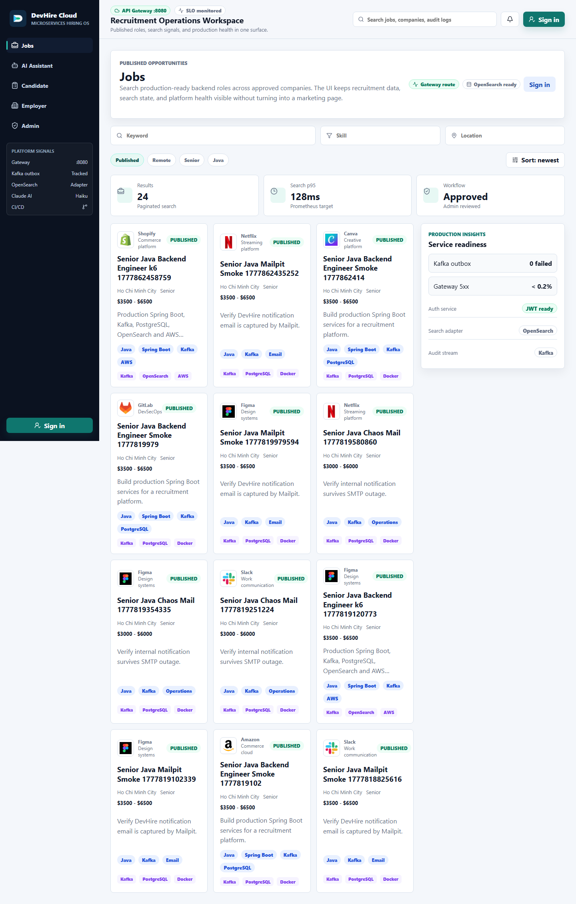
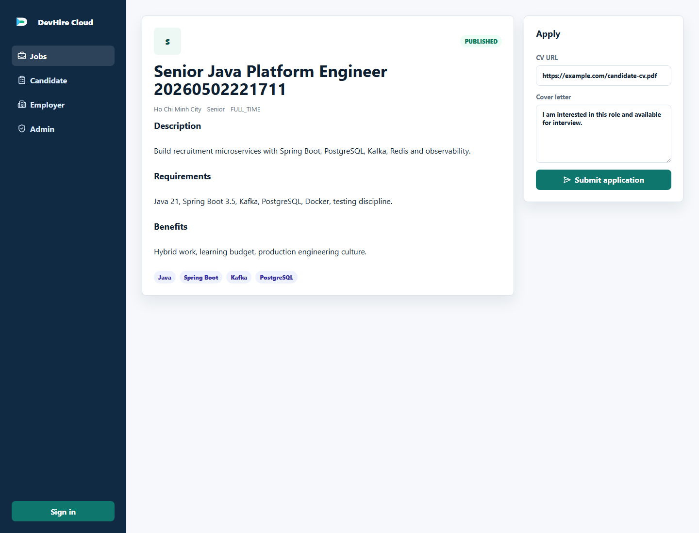
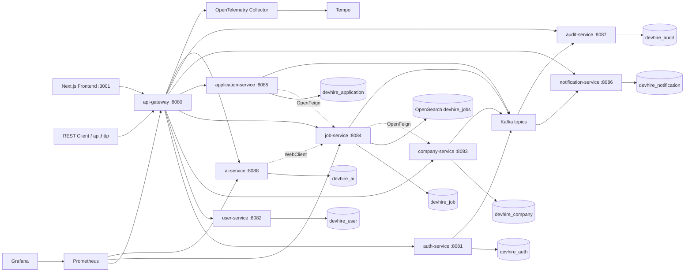

# DevHire Cloud - Production Microservices Recruitment Platform

[](https://github.com/JasonTM17/DevHire_Cloud_Spring_Microservices/actions/workflows/ci.yml)
[](https://github.com/JasonTM17/DevHire_Cloud_Spring_Microservices/actions/workflows/docker.yml)
[](https://github.com/JasonTM17/DevHire_Cloud_Spring_Microservices/actions/workflows/security.yml)
[](https://github.com/JasonTM17/DevHire_Cloud_Spring_Microservices/actions/workflows/docs.yml)
[](https://github.com/JasonTM17/DevHire_Cloud_Spring_Microservices/actions/workflows/codeql.yml)
[](https://github.com/JasonTM17/DevHire_Cloud_Spring_Microservices/actions/workflows/e2e.yml)
[](https://github.com/JasonTM17/DevHire_Cloud_Spring_Microservices/actions/workflows/terraform.yml)

Languages: [Tiếng Việt](README.md) | [English](docs/README_EN.md) | [日本語](docs/README_JA.md)

DevHire Cloud is a production-grade Java 21/Spring Boot microservices portfolio for a recruitment platform: API Gateway, JWT/refresh security, service-owned PostgreSQL databases, Kafka/outbox reliability, OpenSearch search, Next.js frontend, Claude Haiku RAG assistant, Docker runtime, Kubernetes/Helm/GitOps, AWS Terraform blueprint, observability, CI/CD, security scanning, and reviewer-friendly evidence.

## Public GitHub Status

| Signal | Current Public State | Verification / Owner Action |
|---|---|---|
| Latest release | `v0.4.6` is public | [Release](https://github.com/JasonTM17/DevHire_Cloud_Spring_Microservices/releases/tag/v0.4.6) |
| Current hardening evidence | `v0.5.1` runtime depth and coverage evidence builds on the `v0.4.9` cloud completion baseline; release tag waits for protected-branch review | [Review evidence](docs/REVIEW_EVIDENCE.md), [v0.5.1 evidence](docs/release-evidence/v0.5.1.md) |
| About description | Applied | Verified through owner-authenticated GitHub API |
| Topics | Applied: 20 topics | Verified through owner-authenticated GitHub API |
| Branch protection | Applied on `master` | Required check contexts audited before apply |
| Dependabot queue | 0 open PRs after zero-noise cleanup | Remaining updates are handled by scheduled curated batches |
| E2E preview | Self-starting desktop + mobile smoke passed locally | `cd frontend && npm run e2e:all` |
| Cloud blueprint | AWS blueprint ready, not applied | `.\scripts\cloud-verify.ps1`; no AWS credentials or Terraform apply required |

## Reviewer Quick Links

| Need | Open |
|---|---|
| Latest public release | [v0.4.6 release](https://github.com/JasonTM17/DevHire_Cloud_Spring_Microservices/releases/tag/v0.4.6) |
| Canonical reviewer evidence | [Review evidence pack](docs/REVIEW_EVIDENCE.md) |
| Runtime proof | [Runtime evidence v0.4](docs/runtime-evidence-v0.4.md) |
| Portfolio demo data | [Synthetic volume seed](docs/demo-data.md) |
| Data model and seed strategy | [Service-owned seed strategy](docs/data-model-and-seed-strategy.md) |
| Runtime observability proof | [SLO and domain metrics](docs/slo.md), `.\scripts\runtime-observability-smoke.ps1` |
| 5/15/30 minute review route | [Professional review map](docs/professional-review-map.md) |
| Root layout | [Repository structure](docs/repository-structure.md) |
| Service boundaries | [Service catalog](docs/service-catalog.md) |
| Architecture decisions | [Architecture review index](docs/architecture-review-index.md) |
| Product UI system | [Operations design system](docs/design-system.md) |
| Security and supply chain | [Security evidence](docs/security-evidence.md) |
| Cloud deployment blueprint | [Cloud readiness review](docs/cloud-readiness-review.md) |
| Cloud completion scorecard | [Cloud completion scorecard](docs/cloud-completion-scorecard.md) |
| Cloud visual evidence | [Cloud visual evidence](docs/cloud-visual-evidence.md) |
| Production engineering scorecard | [Scorecard](docs/production-engineering-scorecard.md) |
| Remaining gaps and roadmap | [Transparent gaps and next production steps](docs/remaining-gaps-and-roadmap.md) |
| Public repo governance | [Repository health](docs/repository-health.md) |
| Governance verification | [GitHub governance](docs/github-governance.md), [workflow status](scripts/github-workflow-status.ps1), [settings as code](.github/settings.yml) |

Fast reviewer gate:

```powershell
.\scripts\portfolio-verify.ps1 -Docs -Docker
```

Frontend browser smoke without Docker:

```powershell
cd frontend
npm run e2e:all
```

Runtime gate when the Docker stack is running:

```powershell
.\scripts\portfolio-verify.ps1 -Runtime -GatewayUrl http://localhost:8080
.\scripts\runtime-observability-smoke.ps1 -GatewayUrl http://localhost:8080
```

Curated runtime evidence pack when Docker is available:

```powershell
.\scripts\portfolio-demo-evidence.ps1 -StartStack -CaptureScreenshots -PromoteScreenshots
.\scripts\portfolio-runtime-report.ps1 -GatewayUrl http://localhost:8080
```

Cloud blueprint gate without AWS credentials:

```powershell
.\scripts\cloud-verify.ps1
.\scripts\cloud-policy-audit.ps1
.\scripts\terraform-race-smoke.ps1
.\scripts\portfolio-verify.ps1 -Cloud
```

Clean generated local artifacts before handing the repo to a reviewer:

```powershell
.\scripts\clean-local-artifacts.ps1 -DryRun
.\scripts\clean-local-artifacts.ps1 -Apply
```

## 30-Second Review

DevHire Cloud is a production engineering portfolio, not a single-service CRUD demo. It shows how a recruitment platform can be decomposed into service-owned databases, secured through a gateway, coordinated with Kafka/outbox events, searched through OpenSearch, operated with SLO dashboards, released through CI/CD, and explained through a Claude Haiku assistant.

Best reviewer path:

1. Scan the screenshots and release evidence below.
2. Open [Professional review map](docs/professional-review-map.md) for the 5/15/30-minute review route.
3. Run `.\scripts\portfolio-verify.ps1 -Docs -Docker` for a fast local gate.
4. Run `.\scripts\portfolio-verify.ps1 -Runtime -GatewayUrl http://localhost:8080` when Docker is already running and you want runtime proof.
5. Use [Runtime acceptance matrix](docs/runtime-acceptance-matrix.md) to map each production claim to its verification command.
6. Check [Review evidence pack](docs/REVIEW_EVIDENCE.md), [v0.5.1 runtime depth evidence](docs/release-evidence/v0.5.1.md), and [remaining gaps and roadmap](docs/remaining-gaps-and-roadmap.md).

## Production Proof

| Signal | Evidence |
|---|---|
| Microservice boundaries | Dedicated modules, service-owned PostgreSQL databases, Flyway migrations, no shared JPA entities |
| Security | JWT/refresh rotation, gateway validation, role checks, Gitleaks, Trivy, dependency review, secret policy |
| Event reliability | Kafka events, transactional outbox, retry/dead-letter states, idempotent consumers |
| Operations | Prometheus, Grafana SLO dashboard, Loki, Tempo, OpenTelemetry, Mailpit, chaos smoke, DR scripts |
| Delivery | GitHub Actions, Docker matrix builds, GHCR release images, release notes, release evidence |
| Cloud readiness | Kubernetes raw manifests, Helm, Argo CD, AWS Terraform blueprint, External Secrets wiring, policy audit, race-safe Terraform validation |
| AI portfolio layer | Claude Haiku assistant, RAG-style citations, fallback mode, tool traces, AI evaluation script |

## Cloud State Matrix

| Layer | Current status | Reviewer proof |
|---|---|---|
| Docker Compose | Local runtime stack | `docker compose config --quiet` |
| Raw Kubernetes | Renderable, includes `ai-service`, no `latest` tags | `kubectl kustomize deploy/k8s` |
| Helm | Local/staging/prod/AWS values render and lint | `.\scripts\cloud-verify.ps1` |
| GitOps | Argo CD samples target `master` | `deploy/gitops/*.yaml` |
| Terraform AWS | Apply-ready blueprint, no apply run locally | `.\scripts\terraform-validate.ps1` |
| Cloud policy | 72 guardrail checks | `.\scripts\cloud-policy-audit.ps1` |
| Real AWS apply | Not run; requires account, budget, domain, remote state, and secrets | [Apply runbook](docs/cloud-apply-runbook.md) |

## Portfolio Screenshots

Ảnh được tạo từ frontend thật qua Playwright và Docker runtime, không phải mockup tĩnh.

| Jobs | Job Detail |
|---|---|
|  |  |

Docker runtime qua API Gateway thật:


| Candidate | Employer | Admin |
|---|---|---|
|  |  |  |

Claude AI assistant:


Operations evidence từ stack local và repository-owned observability config:

| AI Provider Ops | Mailpit SMTP Sandbox |
|---|---|
|  |  |

| OpenAPI Job Service | Prometheus SLO Rules | Grafana SLO Dashboard |
|---|---|---|
|  |  |  |

Hai ảnh Prometheus/Grafana ở trên được render từ `infra/prometheus/rules/devhire-slo.yml` và `infra/grafana/dashboards/devhire-slo-overview.json`, để reviewer thấy rõ alert rules, dashboard panels, queries và SLO scope thay vì một UI đang loading.

## Vì Sao Dự Án Này Đáng Xem

- Thiết kế microservices có ranh giới rõ: mỗi service có database riêng, migration riêng, API riêng, không share entity JPA.
- Luồng tuyển dụng có đủ vai trò Candidate, Employer và Admin.
- Gateway xử lý JWT validation, CORS, rate limit và routing.
- Event-driven communication dùng Kafka, transactional outbox và idempotent consumers.
- Job search dùng OpenSearch, có PostgreSQL fallback adapter.
- Observability gồm Actuator, Prometheus, Grafana, OpenTelemetry, Tempo và Loki.
- CI/CD có Maven verify, frontend build, Docker image build, security scan, SBOM, Terraform validate, API smoke, AI eval, k6 smoke và Playwright E2E.
- Infrastructure có Docker Compose, Kubernetes manifests, Helm chart, Argo CD sample và AWS Terraform blueprint.

## Kiến Trúc



## Tech Stack

- Java 21, Maven multi-module.
- Spring Boot 3.5.13, Spring Cloud 2025.0.2, Spring Cloud Gateway.
- Spring Security, JWT, BCrypt, role-based authorization.
- PostgreSQL 17, Flyway, JPA/Hibernate.
- Redis cho rate limit và token blacklist.
- Kafka, transactional outbox, idempotent consumers.
- OpenSearch job search, PostgreSQL fallback.
- Anthropic Claude Haiku assistant, RAG-style retrieval, citations, streaming UI.
- OpenFeign cho service-to-service reads.
- Springdoc OpenAPI, Actuator, Micrometer, OpenTelemetry.
- Prometheus, Grafana, Loki, Tempo.
- JUnit 5, Mockito, MockMvc, Testcontainers, JaCoCo.
- Docker Compose, GitHub Actions, Trivy, Gitleaks, SBOM.
- Kubernetes, Helm, Argo CD, AWS Terraform blueprint.
- Next.js 16, React 19, TypeScript.

## Services

| Service | Port | Trách nhiệm |
|---|---:|---|
| api-gateway | 8080 | Public ingress, JWT validation, CORS, Redis rate limit, routing |
| auth-service | 8081 | Register, login, refresh token rotation, logout, `/auth/me` |
| user-service | 8082 | Candidate/employer profile |
| company-service | 8083 | Company onboarding, admin approval/rejection |
| job-service | 8084 | Job workflow, OpenSearch search/filter/page/sort |
| application-service | 8085 | Candidate apply, employer status tracking, status history |
| notification-service | 8086 | Internal notification, SMTP email queue/retry |
| audit-service | 8087 | Audit log ingestion và admin query |
| ai-service | 8088 | Claude Haiku assistant, RAG, citations, metrics, audit events |
| common-lib | - | Error model, headers, event DTOs, outbox support |
| frontend | 3001 | Next.js UI cho jobs, candidate, employer, admin |

## Luồng Demo Chính

1. Employer đăng nhập.
2. Employer tạo company.
3. Admin approve company.
4. Employer tạo job và submit review.
5. Admin approve job.
6. Candidate search job đã publish.
7. Candidate apply bằng CV URL.
8. Employer chuyển application sang `INTERVIEW`.
9. Candidate nhận notification.
10. Candidate hỏi AI assistant về demo path hoặc kiến trúc.
11. Admin xem audit log.

## Chạy Bằng Docker

```powershell
docker compose up --build
```

URL chính:

- Frontend: `http://localhost:3001`
- API Gateway: `http://localhost:8080`
- Grafana: `http://localhost:3000` với `admin/admin`
- Prometheus: `http://localhost:9090`
- OpenSearch: `http://localhost:9200`
- OpenSearch Dashboards: `http://localhost:5601`
- Mailpit email sandbox: `http://localhost:8025`
- Tempo: `http://localhost:3200`
- Loki: `http://localhost:3100`
- AI Assistant: `http://localhost:3001/assistant`

Nếu port local bị trùng, chỉnh các biến `*_HOST_PORT` trong `.env`.

## Build Và Test

Backend:

```powershell
mvn -T1 clean verify
```

Frontend:

```powershell
cd frontend
npm ci
npm run typecheck
npm run build
```

API smoke qua Gateway:

```powershell
.\scripts\api-smoke.ps1 -GatewayUrl http://localhost:8080
```

AI assistant evaluation:

```powershell
.\scripts\ai-eval.ps1 -GatewayUrl http://localhost:8080
```

Performance smoke:

```powershell
.\scripts\perf-suite.ps1 -GatewayUrl http://localhost:8080 -Scenario all -Vus 5 -Duration 30s -UseDocker
```

Operations smoke:

```powershell
.\scripts\email-smoke.ps1 -GatewayUrl http://localhost:8080 -MailpitUrl http://localhost:8025
.\scripts\openapi-verify.ps1 -GatewayUrl http://localhost:8080
.\scripts\chaos-smoke.ps1 -GatewayUrl http://localhost:8080 -Scenario all -Recover
.\scripts\dr-verify.ps1 -GatewayUrl http://localhost:8080
```

Reviewer-friendly verification:

```powershell
.\scripts\portfolio-verify.ps1 -Docs -Docker
.\scripts\portfolio-verify.ps1 -Backend -Frontend -Docs
.\scripts\runtime-preflight.ps1
.\scripts\portfolio-verify.ps1 -Runtime -GatewayUrl http://localhost:8080
.\scripts\portfolio-verify.ps1 -All -StartStack
```

`portfolio-verify.ps1` writes ignored JSON and Markdown evidence under `reports/portfolio-verify/`.

## Demo Accounts

| Role | Email | Password |
|---|---|---|
| ADMIN | `admin@devhire.local` | `Admin@123456` |
| EMPLOYER | `employer@devhire.local` | `Employer@123456` |
| CANDIDATE | `candidate@devhire.local` | `Candidate@123456` |

## API Chính Qua Gateway

- `POST /api/auth/register`
- `POST /api/auth/login`
- `POST /api/auth/refresh`
- `POST /api/auth/logout`
- `GET /api/auth/me`
- `GET /api/users/me`
- `PUT /api/users/me`
- `POST /api/companies`
- `PATCH /api/admin/companies/{id}/approve`
- `POST /api/jobs`
- `GET /api/jobs`
- `PATCH /api/admin/jobs/{id}/approve`
- `POST /api/jobs/{jobId}/applications`
- `PATCH /api/applications/{id}/status`
- `GET /api/notifications`
- `GET /api/admin/audit-logs`
- `POST /api/ai/chat`
- `POST /api/ai/chat/stream`
- `POST /api/admin/ai/knowledge/reindex`
- `GET /api/admin/ai/provider/status`

Xem flow chạy được tại [docs/api.http](docs/api.http).

## Production-Ready Highlights

- Service-owned databases và Flyway migrations.
- Constraints/index thật, optimistic locking ở các aggregate quan trọng.
- JWT access token ngắn hạn, refresh token rotation, Redis blacklist.
- Gateway-side JWT validation, CORS, rate limit.
- Transactional outbox, Kafka events, idempotent consumers.
- OpenSearch adapter với fallback PostgreSQL.
- Claude Haiku AI assistant có fallback demo mode, citations, tool traces, metrics và audit events.
- Admin dashboard hiển thị AI provider diagnostics, circuit breaker state và knowledge reindex.
- Persisted notification delivery status, SMTP retry/backoff và Gmail runbook.
- Mailpit local email sandbox cho SMTP capture thật trong Docker.
- OpenAPI conformance, role-based k6 suite, chaos smoke và DR verification scripts.
- Standard error response có `traceId`.
- Prometheus alerts, Grafana SLO dashboard, trace/log stack.
- Docker multi-stage images chạy non-root.
- Kubernetes raw manifests, Helm chart, Argo CD sample.
- AWS Terraform blueprint có cost guardrails.
- GitHub Actions CI/CD, Trivy, Gitleaks, SBOM, Dependabot, AI eval gate.
- Unit, controller, contract, integration, E2E và performance smoke tests.

## Tài Liệu Quan Trọng

- [Architecture](docs/architecture.md)
- [Service catalog](docs/service-catalog.md)
- [Architecture review index](docs/architecture-review-index.md)
- [Portfolio case study](docs/portfolio-case-study.md)
- [Production readiness](docs/production-readiness.md)
- [Security and supply chain](docs/security.md)
- [Security evidence](docs/security-evidence.md)
- [SLO operations](docs/slo.md)
- [Deployment runbook](docs/deployment.md)
- [Email sandbox](docs/email-sandbox.md)
- [Gmail SMTP runbook](docs/gmail-smtp.md)
- [Backup and restore runbook](docs/runbooks/backup-restore.md)
- [External Secrets and GitOps](docs/external-secrets.md)
- [Claude AI assistant](docs/ai-assistant.md)
- [Claude Haiku provider](docs/claude-haiku.md)
- [AI safety](docs/ai-safety.md)
- [AI evaluation gate](docs/ai-evaluation.md)
- [AWS Terraform blueprint](docs/aws-terraform.md)
- [Cloud readiness review](docs/cloud-readiness-review.md)
- [Runtime reliability review](docs/runtime-reliability-review.md)
- [Runtime acceptance matrix](docs/runtime-acceptance-matrix.md)
- [Runtime evidence v0.4](docs/runtime-evidence-v0.4.md)
- [Reviewer evidence pack](docs/REVIEW_EVIDENCE.md)
- [Portfolio evidence manifest](docs/evidence-manifest.md)
- [Repository hygiene guard](docs/repository-hygiene.md)
- [Unified verification runner](docs/verification.md)
- [Versioning and release hygiene](docs/versioning.md)
- [Dependency maintenance policy](docs/dependency-maintenance.md)
- [Dependency triage v0.4](docs/dependency-triage-v0.4.md)
- [API compatibility policy](docs/api-compatibility.md)
- [Release evidence v0.3.0](docs/release-evidence/v0.3.0.md)
- [Release evidence v0.4.0](docs/release-evidence/v0.4.0.md)
- [Release evidence v0.4.4](docs/release-evidence/v0.4.4.md)
- [Recruiter review guide](docs/recruiter-review-guide.md)
- [Release notes v0.3.0](docs/release-notes/v0.3.0.md)
- [Release notes v0.4.0](docs/release-notes/v0.4.0.md)
- [10-minute demo script](docs/demo-script.md)
- [GitHub profile checklist](docs/github-profile.md)
- [GitHub owner actions](docs/github-owner-actions.md)
- [Architecture Decision Records](docs/ADR/0001-microservices-and-service-databases.md)

## Roadmap Sau v0.4.x

- Deploy AWS Terraform blueprint vào staging account thật.
- Thêm soak test dài hơn và automated error-budget burn simulation.
- Tích hợp email provider sandbox production-grade.
- Bắt buộc signed container provenance trước release.
