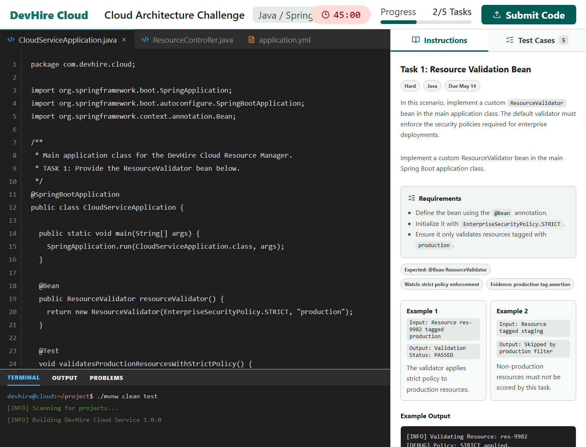
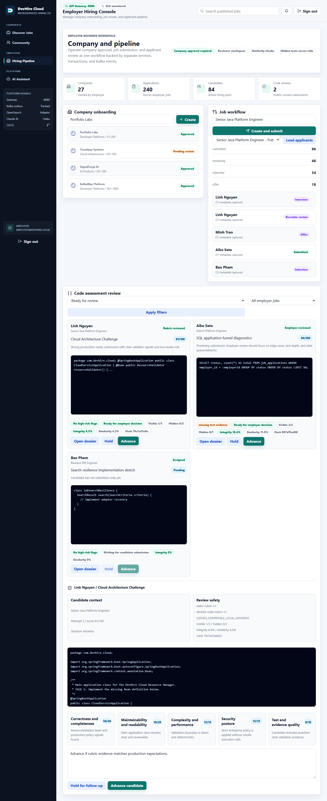
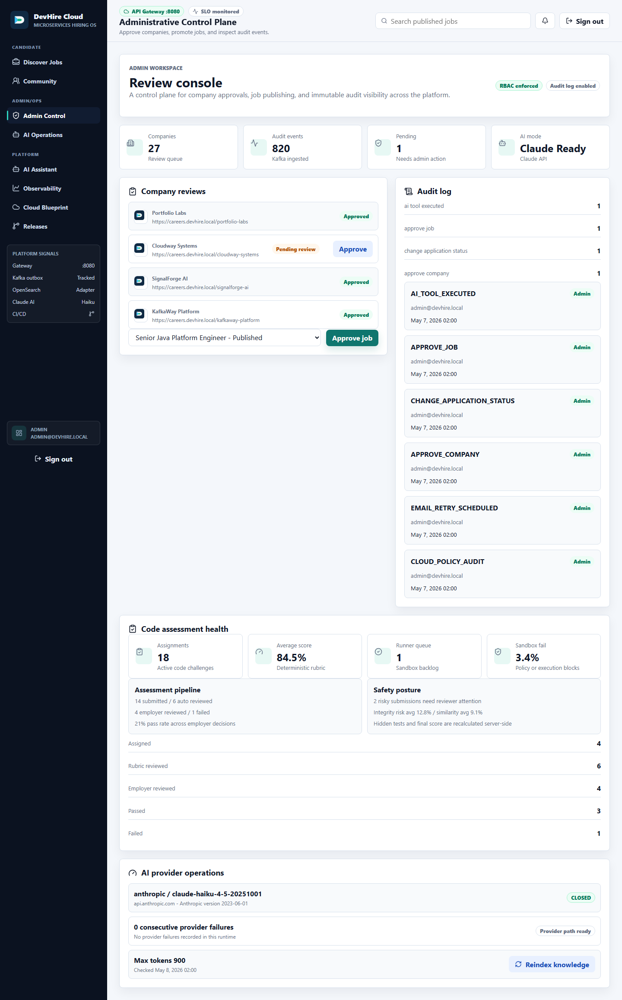

# DevHire Cloud - Microservices Recruitment Platform

DevHire Cloud is a production-engineering portfolio for a recruitment platform: Java 21, Spring Boot 4.0, Next.js, Kafka, OpenSearch, PostgreSQL, Redis, Docker, Kubernetes, Terraform, and a controlled Claude Haiku AI assistant. The repository is written for senior review: it emphasizes service boundaries, owned data, event reliability, observability, security, CI/CD, cloud readiness, and evidence that can be checked without trusting the README.

## 30-Second Reviewer Brief

| Question | Answer |
|---|---|
| What is being demonstrated? | A microservices hiring platform with candidate, employer, admin/ops, platform, AI, and code-assessment workflows. |
| What is the flagship feature? | Code Assessment Studio: Java LeetCode-style candidate coding, visible runner analysis, hidden server-side tests, 75/25 runtime-plus-static scoring, integrity/similarity signals, employer assignment/review, admin challenge authoring, and runner health. |
| What is production-shaped? | Service-owned databases, Flyway migrations, Kafka/outbox, idempotent consumers, Prometheus/Grafana/Loki/Tempo/OTel, security scans, SBOM, Docker image publishing, Helm, raw Kubernetes, Argo CD, and AWS Terraform blueprint. |
| What is not claimed? | This is not a live customer SaaS. AWS remains an apply-ready blueprint until a credentialed deployment phase is approved. |

## Public Repository Status

| Signal | Current |
|---|---|
| Latest public release | [v0.6.0](https://github.com/JasonTM17/DevHire_Cloud_Spring_Microservices/releases/tag/v0.6.0) |
| Current development cycle | `0.6.0-SNAPSHOT` release cut; next snapshot bump is a post-release maintenance step |
| v0.6 Stitch app | Merged into `master`; Code Assessment Studio is the flagship candidate grading, employer review, and admin health workflow |
| Default branch | `master`, protected and PR-governed |
| Dependabot queue | 0 open Dependabot PRs after the 2026-05-14 zero-noise apply; 20 stale/behind/risky PRs were commented, closed, and their remote branches pruned; no dependency PR was force-merged into the release |
| v1 status | Roadmap and acceptance checklist only, not a released tag |

## Reviewer Quick Links

| Need | Link |
|---|---|
| Documentation index | [INDEX.md](INDEX.md) |
| Root README | [../README.md](../README.md) |
| Japanese docs | [README_JA.md](README_JA.md) |
| Current status | [status.md](status.md) |
| Evidence pack | [REVIEW_EVIDENCE.md](REVIEW_EVIDENCE.md) |
| Code assessment proof | [code-assessment-reviewer-proof.md](code-assessment-reviewer-proof.md) |
| Stitch redesign | [ui-redesign-v0.6.md](ui-redesign-v0.6.md) |
| Architecture review | [architecture-review-index.md](architecture-review-index.md) |
| Service catalog | [service-catalog.md](service-catalog.md) |
| Container images | [container-images.md](container-images.md) |
| Security evidence | [security-evidence.md](security-evidence.md) |
| Cloud readiness | [cloud-readiness-review.md](cloud-readiness-review.md) |
| Production scorecard | [production-engineering-scorecard.md](production-engineering-scorecard.md) |

## Architecture and Operations Proof

| Layer | Proof in this repository |
|---|---|
| Edge | Spring Cloud Gateway, JWT validation, CORS, rate limiting, centralized error response, route metrics |
| Core services | auth, user, company, job, application, assessment-runner, notification, audit, AI |
| Data ownership | PostgreSQL database/schema per service, Flyway migrations, no shared JPA entities |
| Messaging | Kafka domain events, transactional outbox, retry/dead-letter posture, idempotent consumers |
| Search | OpenSearch adapter with PostgreSQL fallback |
| AI | Claude Haiku assistant with citations, tool traces, safety guardrails, deterministic fallback, metrics |
| Code assessment | Internal Judge0-compatible runner boundary, Java `CandidateSolution.solve(String input)` contract, visible/hidden stdout fixtures, 75/25 scoring, integrity and similarity risk, audit metadata |
| Observability | Actuator, Prometheus, Grafana, Loki, Tempo, OpenTelemetry, domain KPI dashboards and alert rules |
| Security | JWT/RBAC, refresh-token rotation, gateway spoofing protection, Gitleaks, Trivy, CodeQL, SBOM, branch protection |
| Delivery | Maven verification, Docker image matrix, GHCR/Docker Hub publishing, GitHub Actions, Helm, raw Kubernetes, Argo CD, Terraform AWS blueprint |

## v0.6 Product Surface

| Area | Routes and workflows |
|---|---|
| Candidate | `/jobs`, `/jobs/[id]`, `/candidate`, applications, profile, code assessments, offers, interview prep, roadmap, skill analytics, community |
| Employer | `/employer`, `/companies/[slug]`, code assessment review dossier |
| Admin/Ops | `/admin`, `/admin/ai`, code-assessment health, AI operations, platform signals |
| Platform | `/assistant`, `/platform/observability`, `/platform/cloud`, `/platform/releases` |

The v0.6 UI follows Stitch project `projects/5421325194779586117` with a hybrid design system. Public candidate and job-discovery pages use an ITViec-inspired marketplace pattern: search-first red/white surfaces, salary/location/company prominence, compact filters, and mobile-safe job cards without copying ITViec brand assets. Employer, admin, and platform pages keep the "DevHire Cloud Operations" control-plane style: dark navigation, light operational workspace, dense panels, 8px radius, Inter typography, and evidence-heavy status language. Route-matrix screenshots are checked for broken assets, overflow, raw UUIDs, `UNKNOWN`, loading-only states, fallback banners, smoke labels, mojibake, and hidden assessment payloads.

## Cloud State Matrix

| Target | State | Verification |
|---|---|---|
| Docker Compose | Full local stack for backend, frontend, data, messaging, and observability | `docker compose config --quiet` |
| Raw Kubernetes | Renderable manifests, no `latest`, includes `ai-service` | `kubectl kustomize deploy/k8s` |
| Helm | Local, staging, production, and AWS values | `.\scripts\cloud-verify.ps1` |
| Terraform AWS | Apply-ready blueprint validation; no credentials required for CI validation | `.\scripts\terraform-validate.ps1` |
| GitOps | Argo CD samples targeting `master` | [deploy/gitops](../deploy/gitops) |

## Container Images

Release images publish to GHCR as `ghcr.io/jasontm17/devhire/<service>:<tag>` with commit SHA tags, OCI labels, SBOM, and BuildKit provenance. Docker Hub mirrors are available as `docker.io/nguyenson1710/devhire-cloud-<service>:<tag>` when the Docker Hub secrets are configured. The current preview set was also pushed locally through Docker Desktop. See [container images](container-images.md).

## Run and Verify Locally

```powershell
docker compose up -d --build
.\scripts\api-smoke.ps1 -GatewayUrl http://localhost:8080
.\scripts\code-assessment-smoke.ps1 -GatewayUrl http://localhost:8080
```

Frontend preview without Docker:

```powershell
cd frontend
npm ci
npm run e2e:all
```

Portfolio verification:

```powershell
.\scripts\version-consistency.ps1
.\scripts\portfolio-verify.ps1 -Docs -Docker -Cloud
.\scripts\docs-parity.ps1
```

## Demo Accounts

| Role | Email | Password |
|---|---|---|
| Admin | `admin@devhire.local` | `Admin@123456` |
| Employer | `employer@devhire.local` | `Employer@123456` |
| Candidate | `candidate@devhire.local` | `Candidate@123456` |

## Product Evidence

| Jobs | Job Detail |
|---|---|
|  |  |

| Candidate | Employer | Admin |
|---|---|---|
|  |  |  |

| Code Assessment Studio | Employer Review Dossier | Admin Assessment Health |
|---|---|---|
|  |  |  |

| Stitch Candidate Apps | Stitch Cloud | Stitch Releases |
|---|---|---|
|  |  |  |

| AI Assistant | Grafana SLO | Prometheus Rules |
|---|---|---|
|  |  |  |

The full visual evidence set is machine-checked in [evidence-manifest.json](evidence-manifest.json).

## v1 Roadmap

`v1.0.0` is not released. The v1 roadmap focuses on product UX depth, backend integration maturity, API/event compatibility, observability SLO maturity, deterministic data depth, cloud apply evidence, and supply-chain hardening. See [v1 reviewer guide](v1-reviewer-guide.md), [v1 demo script](v1-demo-script.md), and [v1 production gap register](v1-production-gap-register.md).

## Honest Scope

DevHire Cloud is a production-engineering portfolio, not a claim of live customer traffic. It does not claim external penetration testing, a production AWS account, or real customer data. Secrets are not committed; cloud apply remains a separate, credentialed operation.
