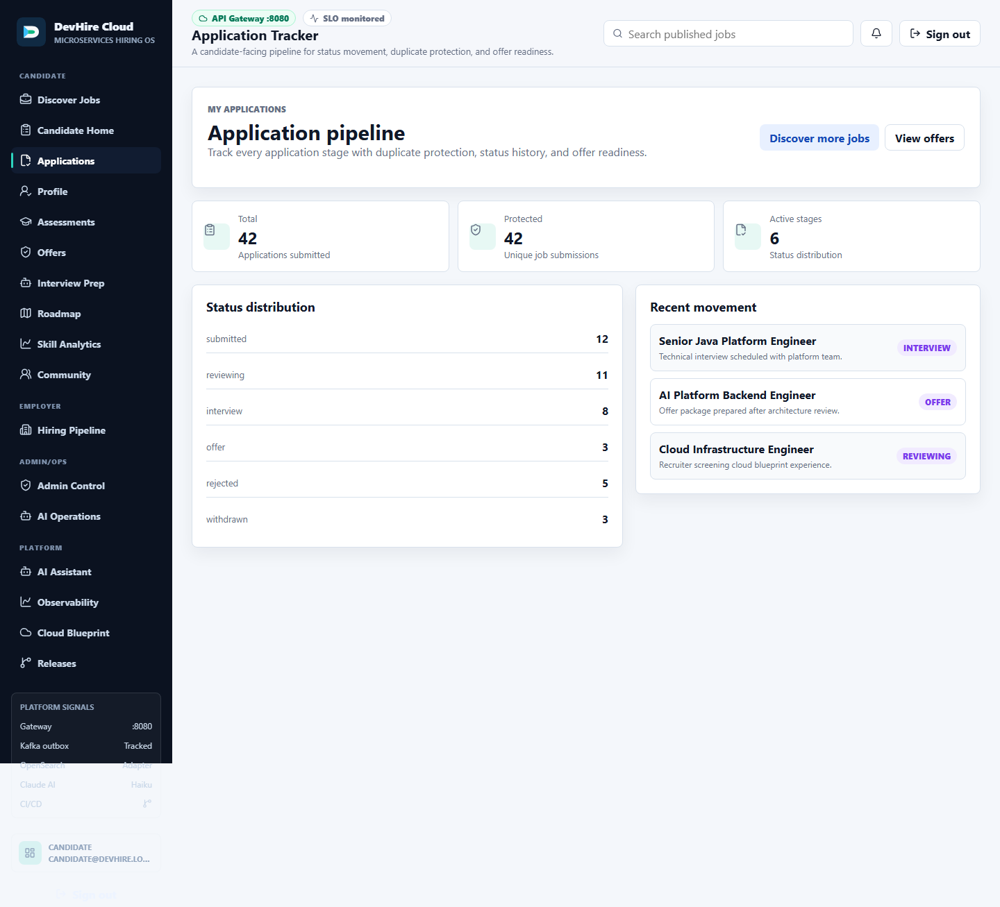
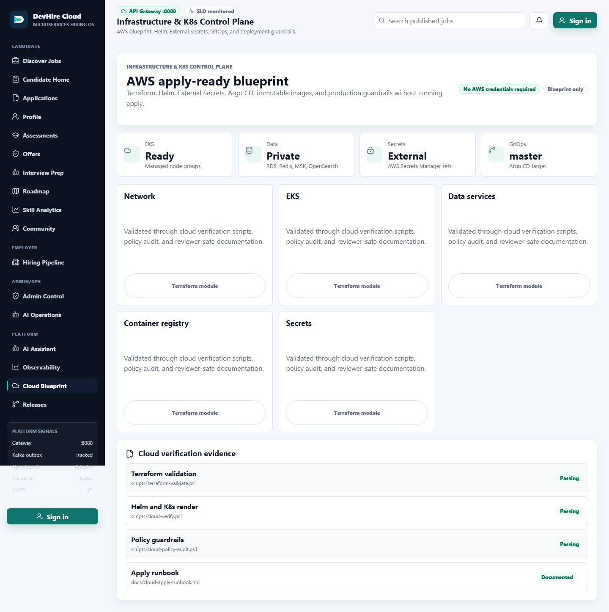
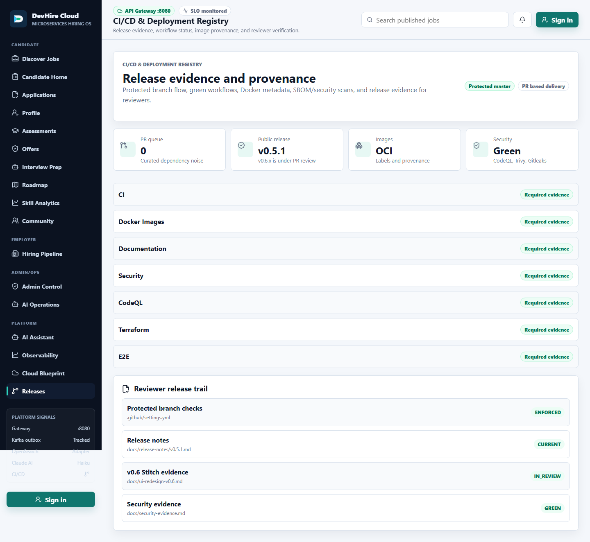

# DevHire Cloud - Microservices Recruitment Platform

DevHire Cloud is a Java 21 / Spring Boot 3.5 production engineering portfolio for a recruitment platform similar to a small ITviec or LinkedIn Jobs. It demonstrates real service boundaries, service-owned databases, Kafka/outbox eventing, OpenSearch, observability, Docker/Kubernetes/Terraform, CI/CD, security evidence, and a Claude Haiku AI assistant.

## Public Repository Status

| Signal | Current |
|---|---|
| Latest public release | [v0.5.1](https://github.com/JasonTM17/DevHire_Cloud_Spring_Microservices/releases/tag/v0.5.1) |
| Current development cycle | `0.6.0-SNAPSHOT` |
| v0.6 Stitch app | PR #43 green; v0.6.4 adds candidate code assessment grading on the stacked branch |
| Branch governance | Protected `master`, PR-based release flow |
| Dependabot queue | 0 open PRs at the latest cleanup scan |
| v1 status | Roadmap and acceptance checklist only, not a released tag |

## Reviewer Quick Links

| Need | Link |
|---|---|
| Vietnamese README | [../README.md](../README.md) |
| Japanese README | [README_JA.md](README_JA.md) |
| Current status | [status.md](status.md) |
| Evidence pack | [REVIEW_EVIDENCE.md](REVIEW_EVIDENCE.md) |
| v0.6 Stitch redesign | [ui-redesign-v0.6.md](ui-redesign-v0.6.md) |
| Architecture | [architecture-review-index.md](architecture-review-index.md) |
| Service catalog | [service-catalog.md](service-catalog.md) |
| Security evidence | [security-evidence.md](security-evidence.md) |
| Cloud readiness | [cloud-readiness-review.md](cloud-readiness-review.md) |
| Production scorecard | [production-engineering-scorecard.md](production-engineering-scorecard.md) |

## Architecture Proof

| Layer | Implementation |
|---|---|
| Edge | Spring Cloud Gateway, JWT validation, CORS, rate limiting, centralized error response |
| Core services | auth, user, company, job, application, notification, audit, AI |
| Data ownership | PostgreSQL database/schema per service, Flyway migrations, no shared JPA entities |
| Messaging | Kafka events plus transactional outbox and idempotent consumers |
| Search | OpenSearch adapter with PostgreSQL fallback |
| AI | Claude Haiku assistant with citations, tool traces, safety guardrails, and metrics |
| Code assessment | Deterministic rubric grading for candidate submissions, employer review, admin health metrics |
| Observability | Actuator, Prometheus, Grafana, Loki, Tempo, OpenTelemetry, domain KPI dashboards |
| Security | JWT/RBAC, refresh token rotation, Gitleaks, Trivy, CodeQL, SBOM, protected `master` |
| Delivery | Maven, Docker matrix, GitHub Actions, Helm, Kubernetes, Argo CD, AWS Terraform blueprint |

## v0.6 Full-App Product Surface

| Area | Routes |
|---|---|
| Candidate | `/jobs`, `/jobs/[id]`, `/candidate`, applications, profile, code assessments, offers, interview prep, roadmap, skill analytics, community |
| Employer | `/employer`, `/companies/[slug]`, code-review queue |
| Admin/Ops | `/admin`, `/admin/ai`, code assessment health |
| Platform | `/assistant`, `/platform/observability`, `/platform/cloud`, `/platform/releases` |

The v0.6 implementation follows Stitch project `projects/5421325194779586117`. Primary screenshots are checked to avoid raw UUIDs, `UNKNOWN`, loading-only states, smoke labels, offline banners, and fallback banners. v0.6.4 turns Skill Assessment into a real code grading workflow with safe static scoring; sandbox execution is reserved for a later isolated-worker phase.

## Cloud State Matrix

| Target | State | Verification |
|---|---|---|
| Docker Compose | Full local stack | `docker compose config --quiet` |
| Raw Kubernetes | Renderable, no `latest`, includes `ai-service` | `kubectl kustomize deploy/k8s` |
| Helm | Local/staging/prod/AWS values | `.\scripts\cloud-verify.ps1` |
| Terraform AWS | Blueprint validate only, no AWS credentials required | `.\scripts\terraform-validate.ps1` |
| GitOps | Argo CD samples targeting `master` | [deploy/gitops](../deploy/gitops) |

## Run Locally

```powershell
docker compose up -d --build
.\scripts\api-smoke.ps1 -GatewayUrl http://localhost:8080
```

Frontend preview without Docker:

```powershell
cd frontend
npm ci
npm run e2e:all
```

Portfolio verification:

```powershell
.\scripts\version-consistency.ps1
.\scripts\portfolio-verify.ps1 -Docs -Docker -Cloud
.\scripts\docs-parity.ps1
```

## Demo Accounts

| Role | Email | Password |
|---|---|---|
| Admin | `admin@devhire.local` | `Admin@123456` |
| Employer | `employer@devhire.local` | `Employer@123456` |
| Candidate | `candidate@devhire.local` | `Candidate@123456` |

## Product Screenshots

| Jobs | Job Detail |
|---|---|
|  |  |

| Candidate | Employer | Admin |
|---|---|---|
|  |  |  |

| Stitch Candidate Apps | Stitch Cloud | Stitch Releases |
|---|---|---|
|  |  |  |

| Assistant | Grafana SLO | Prometheus Rules |
|---|---|---|
|  |  |  |

The full visual evidence set is machine-checked in [evidence-manifest.json](evidence-manifest.json).

## v1 Roadmap

`v1.0.0` is not released. The v1 roadmap covers product UX, backend integration maturity, API/event compatibility, observability SLOs, deterministic data depth, cloud apply-ready evidence, and supply-chain hardening. See [v1 reviewer guide](v1-reviewer-guide.md), [v1 demo script](v1-demo-script.md), and [v1 production gap register](v1-production-gap-register.md).

## Honest Scope

This is a production engineering portfolio, not a live customer SaaS claim. AWS remains an apply-ready blueprint unless a separate credentialed cloud deployment phase is approved.
