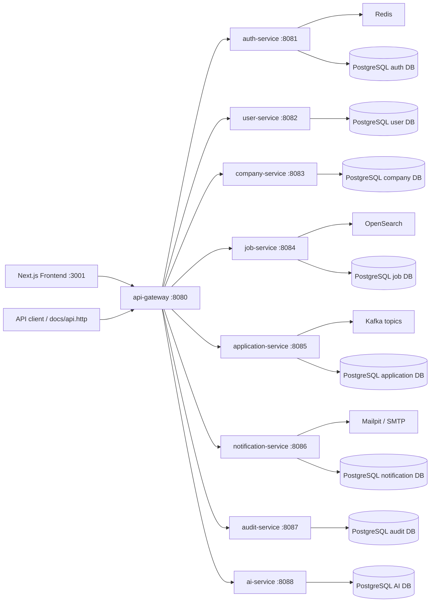

# DevHire Cloud

Production-grade Java 21 / Spring Boot microservices recruitment platform for backend, DevOps, cloud, and solution architecture portfolio review.

[Vietnamese](../README.md) | [English](README_EN.md) | [Japanese](README_JA.md)

DevHire Cloud models a compact ITviec / LinkedIn Jobs platform with authentication, employer onboarding, company and job review, candidate applications, notifications, audit logging, search, AI-assisted recruiter explanations, observability, CI/CD, Docker, Kubernetes, Helm, GitOps, Terraform, and reviewer evidence.

## 30-Second Proof

| Signal | Evidence |
|---|---|
| Microservices | API Gateway plus eight backend services, each with its own package boundary, database schema, Flyway migrations, and API contracts |
| Security | JWT access tokens, refresh rotation, Redis blacklist, RBAC, CORS, rate limiting, secret policy, Gitleaks, Trivy, CodeQL |
| Reliability | Kafka events, transactional outbox, retry/dead-letter states, idempotent consumers, chaos smoke scripts |
| Search | OpenSearch adapter with PostgreSQL fallback and runtime smoke coverage |
| Operations | Actuator, Prometheus, Grafana SLO dashboard, Loki, Tempo, OpenTelemetry, Mailpit, backup/restore runbooks |
| Delivery | Maven verify, frontend typecheck/build/E2E, Docker image matrix, SBOM, security scans, release evidence |
| Cloud readiness | Docker Compose, Kubernetes manifests, Helm chart, Argo CD sample, AWS Terraform blueprint, External Secrets wiring |
| AI layer | Claude Haiku assistant with RAG-style citations, tool traces, fallback mode, metrics, audit events, and eval scripts |

## Public Repository Status

| Item | Current state | Verification |
|---|---|---|
| Latest public release | `v0.4.6` | [GitHub release](https://github.com/JasonTM17/DevHire_Cloud_Spring_Microservices/releases/tag/v0.4.6) |
| Current hardening evidence | `v0.5.1` runtime depth and coverage evidence builds on the `v0.4.9` cloud completion baseline; release tag waits for protected-branch review | [Review evidence](REVIEW_EVIDENCE.md), [v0.5.1 evidence](release-evidence/v0.5.1.md) |
| GitHub About / homepage / topics | Applied through governance automation | [Repository governance](github-governance.md) |
| Branch protection | `master` protected; strict admin enforcement is part of the v0.4.7 gate | [Branch protection](branch-protection.md) |
| Dependabot queue | 0 open PRs after zero-noise cleanup | [Dependabot cleanup](dependabot-cleanup-v0.4.md) |
| E2E smoke | Self-starting desktop and mobile frontend smoke | `cd frontend && npm run e2e:all` |
| Cloud blueprint | AWS blueprint ready, not applied | `.\scripts\cloud-verify.ps1`; no AWS credentials or Terraform apply required |

## Reviewer Quick Links

| Need | Open |
|---|---|
| Canonical evidence pack | [REVIEW_EVIDENCE.md](REVIEW_EVIDENCE.md) |
| 5 / 15 / 30 minute review route | [professional-review-map.md](professional-review-map.md) |
| Production scorecard | [production-engineering-scorecard.md](production-engineering-scorecard.md) |
| Runtime proof | [runtime-evidence-v0.4.md](runtime-evidence-v0.4.md) |
| Portfolio demo data | [demo-data.md](demo-data.md) |
| Data model and seed strategy | [data-model-and-seed-strategy.md](data-model-and-seed-strategy.md) |
| Runtime observability proof | [slo.md](slo.md), `.\scripts\runtime-observability-smoke.ps1` |
| Service catalog | [service-catalog.md](service-catalog.md) |
| Architecture decisions | [architecture-review-index.md](architecture-review-index.md) |
| API compatibility | [api-compatibility.md](api-compatibility.md) |
| Security and supply chain | [security-evidence.md](security-evidence.md) |
| Cloud blueprint | [cloud-readiness-review.md](cloud-readiness-review.md) |
| Cloud completion scorecard | [cloud-completion-scorecard.md](cloud-completion-scorecard.md) |
| Cloud visual evidence | [cloud-visual-evidence.md](cloud-visual-evidence.md) |
| Remaining gaps and roadmap | [remaining-gaps-and-roadmap.md](remaining-gaps-and-roadmap.md) |
| v1 reviewer guide | [v1-reviewer-guide.md](v1-reviewer-guide.md) |
| v1 release evidence | [release-evidence/v1.0.0.md](release-evidence/v1.0.0.md) |
| v1 demo script | [v1-demo-script.md](v1-demo-script.md) |
| Demo script | [demo-script.md](demo-script.md) |

Fast local verification:

```powershell
.\scripts\portfolio-verify.ps1 -Docs -Docker
```

Frontend E2E without Docker:

```powershell
cd frontend
npm ci
npm run e2e:all
```

Full runtime gate after the Docker stack is running:

```powershell
.\scripts\portfolio-verify.ps1 -Runtime -GatewayUrl http://localhost:8080
.\scripts\runtime-observability-smoke.ps1 -GatewayUrl http://localhost:8080
```

Curated runtime evidence pack:

```powershell
.\scripts\portfolio-demo-evidence.ps1 -StartStack -CaptureScreenshots -PromoteScreenshots
.\scripts\portfolio-runtime-report.ps1 -GatewayUrl http://localhost:8080
```

Cloud blueprint verification without AWS credentials:

```powershell
.\scripts\cloud-verify.ps1
.\scripts\cloud-policy-audit.ps1
.\scripts\terraform-race-smoke.ps1
.\scripts\portfolio-verify.ps1 -Cloud
```

v1 release evidence gate:

```powershell
.\scripts\v1-release-verify.ps1 -Cloud
.\scripts\v1-cloud-evidence.ps1
```

## Cloud State Matrix

| Layer | Current status | Reviewer proof |
|---|---|---|
| Docker Compose | Local runtime stack | `docker compose config --quiet` |
| Raw Kubernetes | Renderable, includes `ai-service`, no `latest` tags | `kubectl kustomize deploy/k8s` |
| Helm | Local, staging, prod, and AWS values lint/render | `.\scripts\cloud-verify.ps1` |
| GitOps | Argo CD samples target `master` | `deploy/gitops/*.yaml` |
| Terraform AWS | Apply-ready blueprint, not applied locally | `.\scripts\terraform-validate.ps1` |
| Cloud policy | 72 guardrail checks | `.\scripts\cloud-policy-audit.ps1` |
| Real AWS apply | Requires account, budget, domain, remote state, and secrets | [cloud-apply-runbook.md](cloud-apply-runbook.md) |

Clean generated local artifacts before review:

```powershell
.\scripts\clean-local-artifacts.ps1 -DryRun
.\scripts\clean-local-artifacts.ps1 -Apply
```

## Architecture



## Services

| Service | Port | Responsibility |
|---|---:|---|
| `api-gateway` | 8080 | Public ingress, JWT validation, CORS, Redis rate limiting, routing |
| `auth-service` | 8081 | Register, login, refresh rotation, logout, `/auth/me`, demo accounts |
| `user-service` | 8082 | Candidate and employer profile management |
| `company-service` | 8083 | Employer company onboarding and admin approval workflow |
| `job-service` | 8084 | Job CRUD, review workflow, search/filter/page/sort |
| `application-service` | 8085 | Candidate applications, duplicate prevention, status history |
| `notification-service` | 8086 | Internal notifications, SMTP queue, Mailpit/Gmail profiles |
| `audit-service` | 8087 | Kafka audit ingestion and admin audit filters |
| `ai-service` | 8088 | Claude Haiku assistant, conversations, RAG context, tool traces |
| `frontend` | 3001 | Next.js job browsing, dashboards, assistant workspace |

## Main Business Flow

1. Candidate, employer, or admin signs in through the gateway.
2. Employer creates a company profile.
3. Admin approves or rejects the company.
4. Employer creates and submits a job for review.
5. Admin approves the job and it becomes searchable.
6. Candidate searches jobs, opens job detail, and applies with a CV URL.
7. Employer reviews applications and changes status.
8. Candidate receives internal and optional email notifications.
9. Audit service records important actions.
10. AI assistant explains the platform, demo route, jobs, risks, and operations evidence with citations.

## Run Locally

```bash
docker compose up --build
```

Local URLs:

| Component | URL |
|---|---|
| Frontend | `http://localhost:3001` |
| API Gateway | `http://localhost:8080` |
| Swagger through services | `/swagger-ui.html` on each service port |
| Grafana | `http://localhost:3000` |
| Prometheus | `http://localhost:9090` |
| OpenSearch | `http://localhost:9200` |
| Mailpit | `http://localhost:8025` |
| AI assistant | `http://localhost:3001/assistant` |

## Verification Commands

Backend:

```bash
mvn -T1 clean verify
```

Coverage:

```powershell
.\scripts\check-coverage.ps1
```

Frontend:

```powershell
cd frontend
npm run typecheck
npm run build
npm run e2e:all
```

Runtime smoke:

```powershell
.\scripts\api-smoke.ps1 -GatewayUrl http://localhost:8080
.\scripts\ai-eval.ps1 -GatewayUrl http://localhost:8080
.\scripts\email-smoke.ps1 -GatewayUrl http://localhost:8080 -MailpitUrl http://localhost:8025
.\scripts\openapi-verify.ps1 -GatewayUrl http://localhost:8080
.\scripts\perf-suite.ps1 -GatewayUrl http://localhost:8080 -Scenario all -Vus 5 -Duration 30s -UseDocker
```

Repository evidence:

```powershell
.\scripts\docs-quality.ps1
.\scripts\evidence-audit.ps1
.\scripts\repo-hygiene.ps1
.\scripts\public-portfolio-audit.ps1
.\scripts\github-facade-assert.ps1 -AllowOwnerActions
```

## Demo Accounts

| Role | Email | Password |
|---|---|---|
| Admin | `admin@devhire.local` | `Admin@123456` |
| Employer | `employer@devhire.local` | `Employer@123456` |
| Candidate | `candidate@devhire.local` | `Candidate@123456` |

## Portfolio Screenshots

Screenshots are generated from the real frontend through Playwright and Docker/runtime checks, then promoted into `docs/screenshots`.

| Jobs | Job Detail |
|---|---|
|  |  |

| Candidate | Employer | Admin |
|---|---|---|
|  |  |  |


| OpenAPI | Prometheus Rules | Grafana SLO |
|---|---|---|
|  |  |  |

## Why This Looks Like Production Engineering

- The repository includes service code, migrations, tests, Dockerfiles, GitHub workflows, Helm, Terraform, runbooks, SLO dashboards, and evidence scripts.
- Runtime claims are mapped to commands instead of prose-only assertions.
- GitHub repository metadata, branch protection, Dependabot triage, release evidence, and workflow status are treated as part of the product surface.
- Sensitive configuration is environment-driven; `.env`, tokens, SMTP credentials, AWS credentials, generated reports, backups, and `tfstate` are ignored.
- Heavy gates are separated from fast reviewer gates so the project remains inspectable without pretending every expensive smoke test should block each pull request.

## Roadmap

- Deploy the AWS blueprint into a real staging account.
- Add longer soak tests and automated error-budget burn simulations.
- Enforce signed container provenance before production release.
- Add a real email provider sandbox validation outside local Mailpit.
- Add more consumer-driven contracts for every synchronous internal API.
