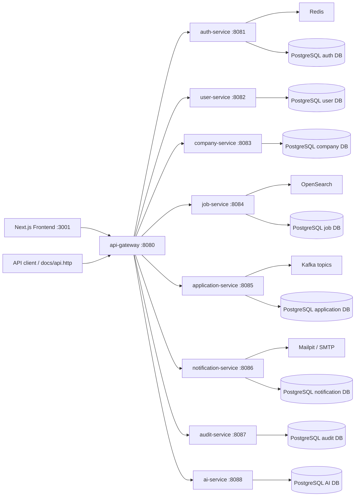

# DevHire Cloud

Java 21 / Spring Boot で構築した、採用プラットフォーム型の production-grade microservices ポートフォリオです。バックエンド、DevOps、クラウド、Solution Architecture のレビューに耐えることを目的にしています。

[Tiếng Việt](../README.md) | [English](README_EN.md) | [日本語](README_JA.md)

DevHire Cloud は、ITviec / LinkedIn Jobs の小規模版を題材に、認証、企業オンボーディング、求人審査、応募管理、通知、監査ログ、検索、AI アシスタント、監視、CI/CD、Docker、Kubernetes、Helm、GitOps、Terraform、レビュー用 evidence をまとめたプロジェクトです。

## 30 秒で分かるポイント

| 項目 | Evidence |
|---|---|
| Microservices | API Gateway と 8 つのバックエンドサービス。各サービスは境界、DB、Flyway migration、API contract を持ちます |
| Security | JWT、refresh token rotation、Redis blacklist、RBAC、CORS、rate limit、secret policy、Gitleaks、Trivy、CodeQL |
| Reliability | Kafka、transactional outbox、retry / dead-letter、idempotent consumer、chaos smoke script |
| Search | OpenSearch adapter と PostgreSQL fallback |
| Operations | Actuator、Prometheus、Grafana SLO、Loki、Tempo、OpenTelemetry、Mailpit、backup/restore runbook |
| Delivery | Maven verify、frontend typecheck/build/E2E、Docker image matrix、SBOM、security scan、release evidence |
| Cloud readiness | Docker Compose、Kubernetes manifests、Helm chart、Argo CD sample、AWS Terraform blueprint、External Secrets wiring |
| AI layer | Claude Haiku assistant、RAG-style citations、tool traces、fallback mode、metrics、audit events、AI eval |

## Public Repository Status

| 項目 | 現在の状態 | 確認方法 |
|---|---|---|
| 最新 public release | `v0.3.0` | [GitHub release](https://github.com/JasonTM17/DevHire_Cloud_Spring_Microservices/releases/tag/v0.3.0) |
| 現在の hardening evidence | `v0.4.6 / v0.4.7` public credibility pass | [Review evidence](REVIEW_EVIDENCE.md), [release evidence](release-evidence/v0.4.6.md) |
| GitHub About / homepage / topics | Governance automation で適用済み | [Repository governance](github-governance.md) |
| Branch protection | `master` protected。v0.4.7 で strict admin enforcement を検証 | [Branch protection](branch-protection.md) |
| Dependabot queue | Zero-noise cleanup 後、open PR は 0 件 | [Dependabot cleanup](dependabot-cleanup-v0.4.md) |
| E2E smoke | Desktop / mobile の self-starting smoke | `cd frontend && npm run e2e:all` |

## Reviewer Quick Links

| 見たいもの | Link |
|---|---|
| Canonical evidence pack | [REVIEW_EVIDENCE.md](REVIEW_EVIDENCE.md) |
| 5 / 15 / 30 分レビュー手順 | [professional-review-map.md](professional-review-map.md) |
| Production scorecard | [production-engineering-scorecard.md](production-engineering-scorecard.md) |
| Runtime proof | [runtime-evidence-v0.4.md](runtime-evidence-v0.4.md) |
| Service catalog | [service-catalog.md](service-catalog.md) |
| Architecture decisions | [architecture-review-index.md](architecture-review-index.md) |
| API compatibility | [api-compatibility.md](api-compatibility.md) |
| Security / supply chain | [security-evidence.md](security-evidence.md) |
| Cloud blueprint | [cloud-readiness-review.md](cloud-readiness-review.md) |
| Demo script | [demo-script.md](demo-script.md) |

高速なローカル確認:

```powershell
.\scripts\portfolio-verify.ps1 -Docs -Docker
```

Docker なしの frontend E2E:

```powershell
cd frontend
npm ci
npm run e2e:all
```

Docker stack 起動後の runtime gate:

```powershell
.\scripts\portfolio-verify.ps1 -Runtime -GatewayUrl http://localhost:8080
```

## Architecture



## Services

| Service | Port | Responsibility |
|---|---:|---|
| `api-gateway` | 8080 | Public ingress、JWT validation、CORS、Redis rate limiting、routing |
| `auth-service` | 8081 | Register、login、refresh rotation、logout、`/auth/me` |
| `user-service` | 8082 | Candidate / employer profile |
| `company-service` | 8083 | Company onboarding と admin approval |
| `job-service` | 8084 | Job CRUD、review workflow、search/filter/page/sort |
| `application-service` | 8085 | Application、duplicate prevention、status history |
| `notification-service` | 8086 | Internal notification、SMTP queue、Mailpit/Gmail profile |
| `audit-service` | 8087 | Kafka audit ingestion と admin filter |
| `ai-service` | 8088 | Claude Haiku assistant、conversation、RAG context、tool trace |
| `frontend` | 3001 | Next.js job browsing、dashboard、assistant workspace |

## Main Business Flow

1. Candidate / Employer / Admin が Gateway 経由でログインします。
2. Employer が会社プロフィールを作成します。
3. Admin が会社を approve / reject します。
4. Employer が求人を作成して review に出します。
5. Admin が求人を approve すると検索対象になります。
6. Candidate が求人を検索し、詳細を開き、CV URL 付きで応募します。
7. Employer が応募を確認し、status を更新します。
8. Candidate は internal notification と任意の email notification を受け取ります。
9. Audit service が重要操作を記録します。
10. AI assistant が platform、demo flow、求人、risk、operations evidence を citations 付きで説明します。

## Run Locally

```bash
docker compose up --build
```

| Component | URL |
|---|---|
| Frontend | `http://localhost:3001` |
| API Gateway | `http://localhost:8080` |
| Grafana | `http://localhost:3000` |
| Prometheus | `http://localhost:9090` |
| OpenSearch | `http://localhost:9200` |
| Mailpit | `http://localhost:8025` |
| AI assistant | `http://localhost:3001/assistant` |

## Verification

Backend:

```bash
mvn -T1 clean verify
```

Coverage:

```powershell
.\scripts\check-coverage.ps1
```

Frontend:

```powershell
cd frontend
npm run typecheck
npm run build
npm run e2e:all
```

Runtime smoke:

```powershell
.\scripts\api-smoke.ps1 -GatewayUrl http://localhost:8080
.\scripts\ai-eval.ps1 -GatewayUrl http://localhost:8080
.\scripts\email-smoke.ps1 -GatewayUrl http://localhost:8080 -MailpitUrl http://localhost:8025
.\scripts\openapi-verify.ps1 -GatewayUrl http://localhost:8080
.\scripts\perf-suite.ps1 -GatewayUrl http://localhost:8080 -Scenario all -Vus 5 -Duration 30s -UseDocker
```

Repository evidence:

```powershell
.\scripts\docs-quality.ps1
.\scripts\evidence-audit.ps1
.\scripts\repo-hygiene.ps1
.\scripts\public-portfolio-audit.ps1
.\scripts\github-facade-assert.ps1 -AllowOwnerActions
```

## Demo Accounts

| Role | Email | Password |
|---|---|---|
| Admin | `admin@devhire.local` | `Admin@123456` |
| Employer | `employer@devhire.local` | `Employer@123456` |
| Candidate | `candidate@devhire.local` | `Candidate@123456` |

## Portfolio Screenshots

Screenshots は実際の frontend を Playwright / Docker runtime check で生成し、`docs/screenshots` に promotion しています。

| Jobs | Job Detail |
|---|---|
|  |  |

| Candidate | Employer | Admin |
|---|---|---|
|  |  |  |


| OpenAPI | Prometheus Rules | Grafana SLO |
|---|---|---|
|  |  |  |

## Production Engineering として見せたい点

- Service code だけでなく、migration、test、Dockerfile、GitHub workflow、Helm、Terraform、runbook、SLO dashboard、evidence script を含みます。
- 文章だけでなく、各 production claim に対応する検証コマンドがあります。
- GitHub metadata、branch protection、Dependabot triage、release evidence、workflow status も production surface として扱います。
- `.env`、token、SMTP credential、AWS credential、generated report、backup、`tfstate` は commit しません。
- Fast gate と heavy runtime gate を分離し、reviewer が無理なく検証できる形にしています。

## Roadmap

- AWS blueprint を実際の staging account に deploy する。
- 長時間 soak test と error-budget burn simulation を追加する。
- Release 前に signed container provenance enforcement を追加する。
- Mailpit 以外の real email provider sandbox validation を追加する。
- すべての synchronous internal API に consumer-driven contract を拡張する。
