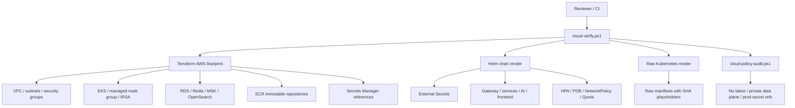
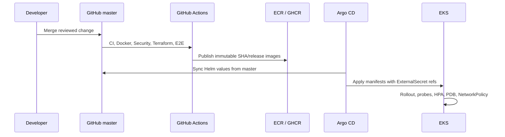
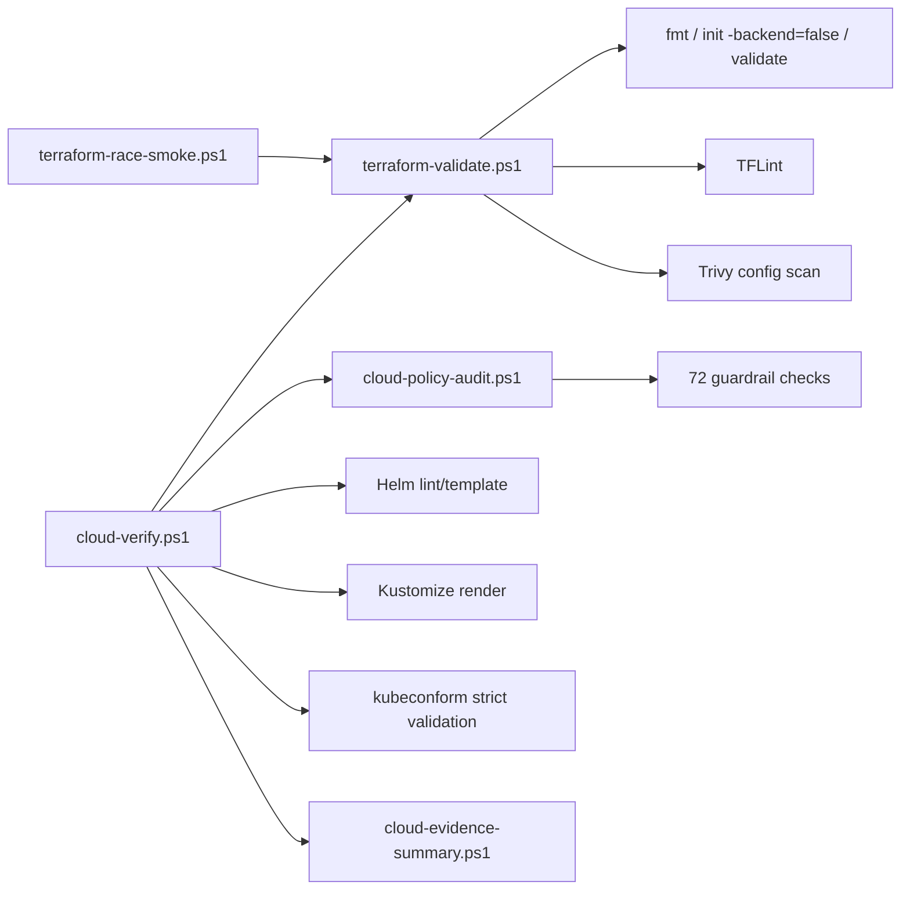

# Cloud Visual Evidence

These diagrams are source-controlled evidence for the AWS blueprint. They are intentionally architecture/render evidence, not screenshots of a live AWS deployment.

## AWS Blueprint Map

## GitOps Flow

## Verification Flow

## Interpretation

- Green cloud verification means the blueprint is apply-ready as code.
- It does not mean an AWS account has been created or charged.
- Real apply requires the owner workflow in [cloud-apply-runbook.md](cloud-apply-runbook.md).
